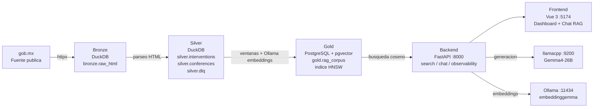
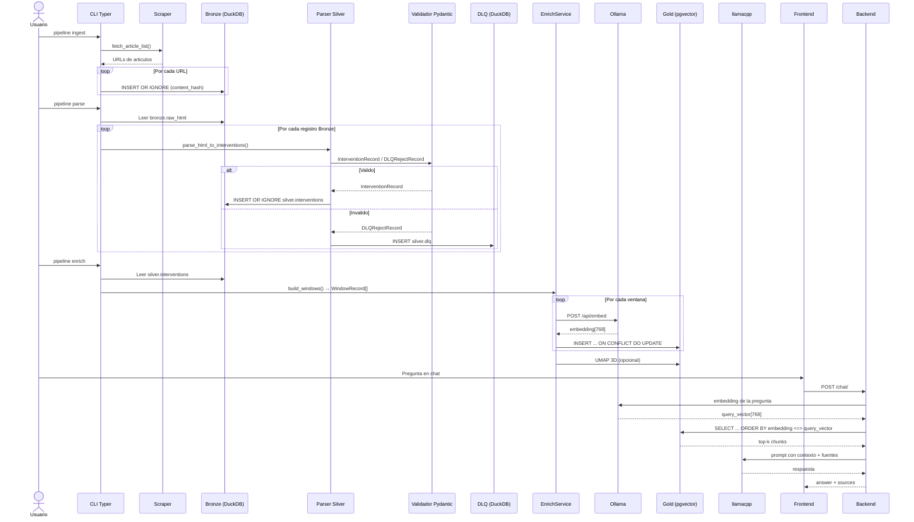
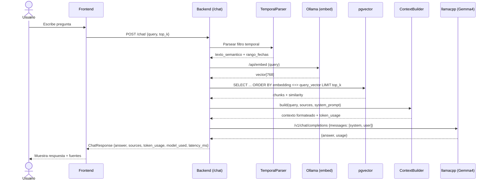

# Datalake Mañaneras

Pipeline de datos con arquitectura medallon (Bronze → Silver → Gold) y sistema RAG
para procesar, estructurar y consultar conferencias de prensa matutinas del Gobierno
de Mexico.

**Fuente oficial:** [https://www.gob.mx/presidencia/es/archivo/articulos](https://www.gob.mx/presidencia/es/archivo/articulos)


[]()
[]()
[]()
[]()
[]()

---

## Descripcion

### Problema que resuelve

Procesa conferencias de prensa matutinas publicadas en gob.mx convirtiendolas en un
corpus indexado y consultable semanticamente. Responde preguntas sobre el contenido
de las conferencias con citas verificables a las fuentes originales, usando un modelo
de lenguaje local sin depender de APIs externas.

## Motivación

Elegí las conferencias matutinas de la Presidencia de México como tema del proyecto porque constituyen una fuente pública, periódica y abundante de información sobre las decisiones, acciones, prioridades y posturas de la administración federal.

Más allá de cualquier valoración política, este tipo de comunicación representa un caso de estudio interesante desde la perspectiva de la ingeniería de datos y la inteligencia artificial: combina grandes volúmenes de texto, diversidad de temas, participación de distintas dependencias, preguntas de periodistas y respuestas que pueden relacionarse entre sí a lo largo del tiempo.

La dinámica de exponer públicamente decisiones, avances y explicaciones de gobierno también ofrece una oportunidad para facilitar la consulta y trazabilidad de información que, aunque está disponible, puede resultar difícil de revisar de forma manual debido a su extensión y frecuencia.

Por ello, el propósito del proyecto no es calificar, promover ni desacreditar a una administración, partido político o figura pública. Su objetivo es construir una herramienta técnica que permita organizar, buscar y consultar el contenido de las conferencias, conservando referencias a las fuentes originales y diferenciando, en la medida de lo posible, entre información documentada, interpretaciones y afirmaciones para las que no existe evidencia suficiente en el corpus.

La selección del tema responde, por tanto, a su relevancia pública, a la disponibilidad de una fuente oficial y a la riqueza técnica que ofrece para demostrar una arquitectura de datos medallón y un sistema RAG con recuperación semántica, citas y mecanismos para reducir alucinaciones.


### Fuente de datos

Todas las publicaciones del archivo de articulos de la Presidencia de Mexico en
`https://www.gob.mx/presidencia/es/archivo/articulos`. Se filtran las versiones
estenograficas de conferencias matutinas mediante criterios en el pipeline de ingesta.

### Tipo de informacion procesada

- HTML crudo de las paginas de conferencias
- Texto estenografico estructurado por participante e intervencion
- Embeddings vectoriales para busqueda semantica
- Chunks de texto con ventana deslizante para RAG

### Usuarios objetivo

Cualquier persona interesada en consultar el
contenido de las conferencias matutinas con respaldo documental.

### Alcance academico

Proyecto de entrega para diplomado en Ingeniería de IA.
Implementa un Data Lakehouse completo con arquitectura medallon, pipeline idempotente,
indice vectorial y sistema RAG con chat conversacional y citas.

### Resultado esperado

Sistema funcional que permite hacer preguntas en lenguaje natural sobre las conferencias
y obtener respuestas basadas exclusivamente en el corpus procesado, con referencias
verificables a las fuentes originales.

---

## Alcance

### Incluido

- [x] Ingesta de HTML desde gob.mx (scraper de archivo de articulos)
- [x] Almacenamiento en capa Bronze (DuckDB) con hash de contenido determinista
- [x] Validacion de registros con contratos Pydantic (capa Silver)
- [x] Separacion de registros invalidos en Dead Letter Queue (DLQ)
- [x] Carga idempotente (INSERT OR IGNORE por clave natural / MERGE por chunk_key)
- [x] Generacion de embeddings via Ollama (modelo embeddinggemma, 768 dims)
- [x] Indice vectorial HNSW en PostgreSQL + pgvector (similitud coseno)
- [x] Chunking con ventana deslizante (1600 tokens, 200 overlap)
- [x] Backend FastAPI con endpoints REST (health, search, chat, observability, config, embeddings 3D)
- [x] Frontend Vue 3 + Pinia + Tailwind con dashboard y chat RAG
- [x] Observabilidad con semaforo de estado, timeline de pipeline y visor de logs
- [x] LLM-as-a-Judge para evaluacion de calidad RAG
- [x] Test suite con >= 90% coverage (backend) y tests de componentes (frontend)
- [x] Despliegue con Docker Compose (3 servicios: postgres, backend, frontend)
- [x] Pipeline CLI con Typer (ingest, parse, enrich, evaluate-rag)
- [x] Visualizacion 3D de embeddings (UMAP + ECharts)
- [x] Filtro temporal en busquedas RAG (parseo de lenguaje natural)
- [x] Interrupcion graceful de pipelines (SIGINT/SIGTERM)


### Estado actual

| Componente               | Estado          | Notas                                          |
| ------------------------ | --------------- | ---------------------------------------------- |
| Ingesta Bronze           | Completo        | 2 lotes, 944 paginas, hash SHA-256             |
| Parsing Silver           | Completo        | 52,401 intervenciones, validacion Pydantic     |
| Enriquecimiento Gold     | Completo        | 10,583 chunks con embeddings de 768 dimensiones |
| Indice vectorial         | Completo        | HNSW en pgvector, similitud coseno             |
| API REST                 | Completo        | 6 routers, 380 tests                           |
| Chat RAG                 | Completo        | Respuestas con fuentes y citas                 |
| Dashboard frontend       | Completo        | Semaforo, timeline, chat, embeddings 3D        |
| Evaluacion RAG           | Completo        | LLM-as-a-Judge con golden dataset              |
| Idempotencia             | Completo        | Verificado en las 3 capas                      |
| Interrupcion graceful    | Completo        | CP-16 completado                               |
| Prueba offline RAG       | No verificado   | Requiere configuracion de red adicional        |
| Evaluacion automatica    | Parcial         | Framework en evaluacion/, no ejecutado aqui    |

---

## Arquitectura



### Componentes

| Componente       | Tecnologia               | Puerto | Descripcion                              |
| ---------------- | ------------------------ | ------ | ---------------------------------------- |
| Fuente           | gob.mx                   | HTTPS  | Archivo publico de articulos             |
| Bronze           | DuckDB                   | local  | HTML crudo con hash de contenido         |
| Silver           | DuckDB                   | local  | Intervenciones validadas con Pydantic    |
| Gold             | PostgreSQL + pgvector    | 5433   | Chunks con embeddings e indice HNSW      |
| Backend API      | FastAPI + Typer          | 8000   | REST API y CLI de pipeline               |
| Frontend         | Vue 3 + Pinia + Tailwind | 5174   | Dashboard, chat RAG, embeddings 3D       |
| LLM (generacion) | llamacpp                 | 9200   | Gemma4-26B Q4_K_M (responde chat RAG)    |
| Embeddings       | Ollama                   | 11434  | embeddinggemma (gemma3, 768 dimensiones) |

---

## Pipeline de datos

### Fuente

- **URL:** `https://www.gob.mx/presidencia/es/archivo/articulos`
- **Criterio de seleccion:** Se extraen todas las URLs de articulos (`/presidencia/es/articulos/*`)
  desde la paginacion del archivo. No se aplica filtro semantico en la ingesta; los articulos
  que no son conferencias simplemente no producen intervenciones en Silver.
- **Estrategia de extraccion:** Scraper con `httpx` que recorre la paginacion del archivo
  (parametro `page`), extrae URLs con regex y descarga cada pagina individual.
- **Frecuencia:** Ejecucion manual bajo demanda. El pipeline completo toma ~5-10 minutos
  para descargar cientos de paginas.

### Bronze

- **Entrada:** URLs de articulos extraidas del scraper
- **Procesamiento:** Descarga asincrona con worker pool (`asyncio.Queue`). Cada pagina
  se descarga con hasta 3 reintentos. Se calcula `content_hash` SHA-256 del contenido
  del tag `<main>` para deduplicacion.
- **Salida:** Registros en `bronze.raw_html` (DuckDB)
- **Persistencia:** DuckDB en `data/lakehouse/ducklake_files.duckdb`
- **Clave natural / dedup:** `content_hash` como PRIMARY KEY. `INSERT OR IGNORE` evita duplicados
- **Metadatos:** `ingestion_run_id`, `source_url`, `ingested_at`
- **Manejo de errores:** 3 reintentos por URL con backoff. URLs que fallan todos los
  reintentos se loguean y se continua con las siguientes.

### Silver

- **Contrato:** Modelos Pydantic V2:
  - `ConferenceRecord`: conference_id (SHA-256 truncado de URL), date (YYYY-MM-DD), title, url
  - `InterventionRecord`: intervention_key, conference_id, participant, text, pregunta_activa, chunk_index
  - `DLQRejectRecord`: source_record_id, rejection_reason, raw_data
- **Normalizacion:** Participantes en mayusculas (validado por Pydantic), texto limpio de tags HTML,
  parseo de fechas desde el texto y URL de la pagina.
- **Validacion:** Cada intervencion se construye como `InterventionRecord` o `DLQRejectRecord`.
  Pydantic valida tipos, longitudes minimas, patrones de fecha (YYYY-MM-DD), indices no negativos.
- **Registros validos:** `silver.interventions` y `silver.conferences` (DuckDB)
- **Cuarentena:** `silver.dlq` con campos `source_record_id`, `rejection_reason`, `raw_data`
- **Motivos de rechazo implementados:**
  - `empty_after_clean`: texto vacio tras limpieza de HTML
  - El parser puede generar mas motivos segun condiciones detectadas durante el parseo

### Gold

- **Preparacion del texto:** Intervenciones de Silver agrupadas por conferencia. Se construye
  texto combinado con formato `PARTICIPANT: texto` y preguntas activas como `P: pregunta`.
- **Chunking:** Ventana deslizante (`build_windows`):
  - `WINDOW_MAX_TOKENS = 1600`
  - `WINDOW_OVERLAP_TOKENS = 200`
  - `MIN_CHUNK_LENGTH = 50` caracteres
  - Las intervenciones que superan individualmente el maximo van en ventana propia
- **Embeddings:** Generados via Ollama API (`/api/embed`). Modelo `embeddinggemma`
  (gemma3, 307.58M params, 768 dimensiones). Con reintento exponencial (2s, 4s, 8s).
- **Payload:** Formato estructurado sin hashes ni IDs tecnicos:
  ```
  Contexto: Conferencia del {fecha}
  Participante: {participant}
  Pregunta activa: {pregunta_activa}
  Respuesta: {text}
  ```
- **Persistencia vectorial:** PostgreSQL + pgvector, tabla `gold.rag_corpus`:
  - Columna `embedding vector(768)`
  - Indice HNSW con `vector_cosine_ops`, m=16, ef_construction=200
  - `ON CONFLICT (chunk_key) DO UPDATE` para idempotencia
  - UMAP 3D opcional para visualizacion (`embedding_3d`)
- **Busqueda semantica:** Distancia coseno via operador `<=>` de pgvector.
  Se recuperan los top-k chunks ordenados por similitud.

### Diagrama de secuencia



---

## Flujo del sistema RAG

1. El usuario escribe una pregunta en el chat del frontend
2. El frontend envia `POST /chat/` al backend con el query
3. El backend parsea la pregunta con `TemporalParser` (LLM-based) para detectar
   si el usuario quiere filtrar por rango de fechas
4. Se genera un embedding de la pregunta via Ollama (`/api/embed`). Si falla,
   se retorna error 503.
5. Se ejecuta busqueda de similitud coseno en `gold.rag_corpus`:
   - Sin filtro temporal: `search_gold_corpus_from_vector()`
   - Con filtro temporal: `search_with_date_filter()` (BETWEEN en conference_date)
6. Se recuperan `top_k` chunks (default 8), cada uno con su `similarity`
   (1 - distancia coseno), `conference_date`, `participant`, `chunk_text`, `url`
7. Se construye el contexto con `ContextBuilder`:
   - System prompt instruye al modelo a responder solo con las fuentes
   - Fuentes agrupadas por conferencia, con fecha y participante
   - Si el contexto excede `MAX_CONTEXT_TOKENS` (8192), se trunca
8. Se envia el prompt a llamacpp (`POST /v1/chat/completions`) con el modelo Gemma4-26B
9. La respuesta se devuelve junto con:
   - `sources`: lista de chunks con fecha, participante, texto, similitud, URL, label cualitativo
   - `token_usage`: tokens de prompt y completion
   - `model_used`: nombre del modelo LLM
   - `latency_ms`: tiempo total de procesamiento
10. El frontend muestra la respuesta con barra de tokens, tarjeta de metrica y lista de fuentes.
    Al hacer clic en una respuesta, el panel de fuentes muestra los chunks recuperados con
    similitud, label cualitativo (Alta/Media/Baja), fragmento de texto y URL expandible.

### Que ocurre sin evidencia suficiente

- Si no se encuentran chunks para el rango de fechas solicitado, el contexto incluye:
  `"No se encontraron resultados para el rango de fechas solicitado."`
- Si los chunks recuperados tienen baja similitud (porque el tema no esta en el corpus),
  el sistema igualmente los envia al LLM. El system prompt instruye:
  `"Si no encuentras informacion en las fuentes, indica que no tienes informacion al respecto."`
- El LLM (Gemma4-26B) responde indicando que no tiene informacion en las fuentes,
  como se verifico con la pregunta trampa sobre invasion extraterrestre.



---

## Tecnologias utilizadas

| Componente          | Tecnologia                     | Proposito                                              |
| ------------------- | ------------------------------ | ------------------------------------------------------ |
| Lenguaje backend    | Python 3.13                    | Pipeline, API, CLI                                     |
| Gestor de paquetes  | uv 0.7+                        | Dependencias Python                                    |
| API REST            | FastAPI 0.115+                 | Endpoints RESTful                                      |
| CLI                 | Typer 0.15+                    | Comandos de pipeline                                   |
| Validacion          | Pydantic V2                    | Schemas y contratos de datos                           |
| Base de datos local | DuckDB 1.2+                    | Bronze y Silver                                        |
| Base vectorial      | PostgreSQL 17 + pgvector       | Gold (embeddings + indice HNSW)                        |
| Embeddings          | Ollama (embeddinggemma/gemma3) | Generacion de vectores de 768 dimensiones              |
| LLM generacion      | llamacpp (Gemma4-26B Q4_K_M)   | Respuestas del chat RAG                                |
| Reduccion 3D        | UMAP-learn 0.5+                | Visualizacion de embeddings                            |
| Frontend            | Vue 3.5 + TypeScript 5.7       | SPA con dashboard y chat                               |
| Estado              | Pinia 3                        | Stores reactivos                                       |
| Estilos             | Tailwind CSS 4                 | Utilidades CSS                                         |
| Build frontend      | Vite 6                         | Dev server y bundling                                  |
| Graficos            | ECharts 6 + echarts-gl 2.1     | Visualizacion 3D de embeddings                         |
| Tests backend       | pytest + pytest-cov            | Unitarios e integracion                                |
| Tests frontend      | Vitest 3 + happy-dom           | Componentes Vue                                        |
| Linting             | Ruff 0.9+                      | Formato y calidad Python                               |
| Type checking       | ty (Pyright)                   | Verificacion estatica backend                          |
| Type checking FE    | vue-tsc                        | Verificacion estatica frontend                         |
| Contenedores        | Docker + Docker Compose        | Despliegue de servicios                                |
| Logging             | structlog 25+                  | Logs estructurados por capa                            |
| HTTP                | httpx 0.28+                    | Cliente async para scraping y APIs                     |

---

## Estructura del repositorio

```
.
├── AGENTS.md                        # Reglas de gobernanza y calidad
├── IMPLEMENTATION_PLAN.md           # Plan de 17 checkpoints (CP-00 a CP-16)
├── Makefile                         # Comandos de conveniencia
├── README.md                        # Este archivo
├── docker-compose.yml               # Servicios: postgres, backend, frontend
├── .env.template                    # Plantilla de variables de entorno
├── opencode.json                    # Config de LSP
│
├── backend/                         # Backend Python (FastAPI + pipeline)
│   ├── Dockerfile                   # Python 3.13-slim + uv
│   ├── pyproject.toml               # Dependencias, ruff, pytest
│   ├── src/lakehouse/
│   │   ├── main.py                  # App FastAPI
│   │   ├── cli.py                   # CLI Typer (pipeline ingest/parse/enrich)
│   │   ├── config.py                # Pydantic Settings
│   │   ├── api/                     # Routers (health, search, chat, observability, config, embeddings)
│   │   ├── db/                      # Conexiones (DuckDB, pgvector) y merge
│   │   │   └── migrations/          # SQL para crear gold.rag_corpus
│   │   ├── pipeline/                # Ingesta, parsing, enrichment, scraper, DLQ, evaluate_rag, interrupt
│   │   ├── schemas/                 # Modelos Pydantic (bronze, silver, gold, search, chat, observability)
│   │   └── services/                # Logica de negocio (IngestService, ParseService, EnrichService, RAG, etc.)
│   ├── tests/                       # Suite de tests (380 tests, 90.29% coverage)
│   ├── data/                        # DuckDB y golden dataset
│   └── logs/                        # Logs de pipeline
│
├── frontend/                        # Frontend Vue 3 + TypeScript
│   ├── Dockerfile                   # Node 22-alpine + pnpm
│   ├── package.json                 # Dependencias (Vue 3, Pinia, ECharts, Tailwind, Vitest)
│   ├── vite.config.ts               # Config Vite + proxy API
│   ├── src/
│   │   ├── main.ts                  # Entry point
│   │   ├── App.vue                  # Componente raiz
│   │   ├── router.ts                # Vue Router
│   │   ├── api/                     # Clientes HTTP (chat, search, observability, embeddings, config)
│   │   ├── stores/                  # Pinia stores (chat, dashboard, observability)
│   │   └── components/              # Componentes (chat, dashboard, pipeline, search, inspector, shared)
│   └── tests/components/            # Tests Vitest (39 tests)
│
├── docs/
│   ├── prd/                         # Documento de requisitos del producto
│   ├── superpowers/
│   │   ├── specs/                   # Especificaciones de diseno (13 archivos)
│   │   └── plans/                   # Planes de implementacion (12 archivos)
│   └── screenshots/                 # Capturas de evidencia
│
├── evaluacion/                      # Framework de evaluacion automatica
│   └── src/evaluador/
│       ├── main.py                  # Entrypoint del evaluador
│       ├── criterios/               # Criterios: bronce, plata, idempotencia, oro
│       └── reporte.py               # Generador de reportes HTML
│
├── governance/
│   └── GATE-S-SPEC-QUALITY.md       # Criterios de calidad de especificaciones
│
└── data/lakehouse/                  # Directorio de datos en runtime (gitignored)
    ├── bronze/
    ├── silver/
    ├── gold/
    └── logs/
```

---

## Requisitos

### Obligatorios

| Requisito          | Version / Nota                                      |
| ------------------ | --------------------------------------------------- |
| Docker             | 20.10+ (con Docker Compose V2)                      |
| Python             | 3.13+                                               |
| uv                 | 0.7+ (gestor de paquetes Python)                    |
| Node.js            | 22+                                                 |
| pnpm               | 9+ (gestor de paquetes Node)                        |
| Ollama             | Servicio corriendo en localhost:11434               |
| llamacpp           | Servidor con endpoint OpenAI-compatible en :9200    |
| Modelo embeddings  | `embeddinggemma` (768 dims) descargado en Ollama     |
| Modelo LLM         | Gemma4-26B (Q4_K_M) cargado en llamacpp             |
| Memoria            | ~16 GB RAM (modelos de embeddings y LLM son locales) |
| Puerto 5433        | PostgreSQL + pgvector                                |
| Puerto 8000        | Backend FastAPI                                      |
| Puerto 5174        | Frontend Vite                                        |
| Puerto 11434       | Ollama                                               |
| Puerto 9200        | llamacpp                                             |

### Opcionales

| Requisito       | Proposito                                      |
| ---------------- | ---------------------------------------------- |
| psql             | Consultas directas a PostgreSQL                |
| make             | Comandos de conveniencia                       |
| GPU              | Acelera Ollama y llamacpp (solo recomendado)    |

---

## Configuracion

### Archivo de entorno

```bash
cp .env.template .env
```

Editar `.env` segun el entorno local. Las variables predeterminadas en `.env.template`
funcionan para desarrollo local con Docker Compose.

### Variables de entorno

| Variable                   | Obligatoria | Valor por defecto                                             | Descripcion                                    |
| -------------------------- | ----------- | ------------------------------------------------------------- | ---------------------------------------------- |
| `APP_ENV`                  | No          | `local`                                                       | Entorno: local, docker, production             |
| `SOURCE_ARCHIVE_URL`       | No          | `https://www.gob.mx/presidencia/es/archivo/articulos`         | URL del archivo de articulos                   |
| `POSTGRES_HOST`            | Si          | `localhost`                                                   | Host de PostgreSQL                              |
| `POSTGRES_PORT`            | No          | `5433`                                                        | Puerto de PostgreSQL (5433 con Docker)          |
| `POSTGRES_DB`              | Si          | `mananeras`                                                   | Nombre de la base de datos                     |
| `POSTGRES_USER`            | Si          | `mananeras`                                                   | Usuario de PostgreSQL                          |
| `POSTGRES_PASSWORD`        | Si          | `mananeras`                                                   | Password de PostgreSQL (NO exponer en prod)     |
| `DUCKLAKE_DATA_PATH`       | No          | `data/lakehouse/ducklake_files.duckdb`                        | Ruta del archivo DuckDB                        |
| `OLLAMA_BASE_URL`          | Si          | `http://localhost:11434`                                      | URL base de Ollama                             |
| `OLLAMA_EMBED_MODEL`       | No          | `embeddinggemma`                                              | Modelo de embeddings en Ollama                 |
| `LLAMACPP_BASE_URL`        | Si          | `http://localhost:9200/v1`                                    | URL base de llamacpp (API OpenAI-compatible)    |
| `LLAMACPP_MODEL`           | No          | `gemma4`                                                      | Nombre del modelo en llamacpp                  |
| `RAG_TOP_K`                | No          | `8`                                                           | Chunks a recuperar por consulta                |
| `MAX_CONTEXT_TOKENS`       | No          | `8192`                                                        | Limite de tokens para la ventana de contexto   |
| `MAX_INGEST_POOL`          | No          | `1`                                                           | Workers paralelos de ingesta                   |
| `TEMPORAL_PARSER_TEMPERATURE` | No       | `0.1`                                                         | Temperatura del parser temporal                |
| `TEMPORAL_PARSER_MAX_RETRIES` | No       | `3`                                                           | Reintentos del parser temporal                 |
| `TEMPORAL_PARSER_MAX_TOKENS`  | No       | `1200`                                                        | Tokens maximos del parser temporal             |

### Modelo de embeddings

- **Nombre en Ollama:** `embeddinggemma` (gemma3)
- **Parametros:** 307.58M
- **Dimension:** 768

### LLM de generacion

- **Nombre en llamacpp:** `gemma4` → `models/Gemma4-26B-A4B-QAT-Uncensored-HauhauCS-Balanced-Q4_K_M.gguf`
- **Tamano:** ~16.8 GB en disco, ~25.2B parametros
- **Contexto maximo:** 250,112 tokens (limitado a `MAX_CONTEXT_TOKENS` = 8192 en el proyecto)

---

## Ejecucion del proyecto

### 11.1 Preparar el entorno

```bash
# Clonar el repositorio
git clone <repo-url> lakehouse-mananeras
cd lakehouse-mananeras

# Configurar variables de entorno
cp .env.template .env
# Editar .env si es necesario

# Instalar dependencias
make install
# o manualmente:
cd backend && uv sync && cd ..
cd frontend && pnpm install && cd ..
```

### 11.2 Levantar infraestructura

```bash
# Iniciar servicios Docker
docker compose up -d

# Verificar estado
docker compose ps
# Debe mostrar: postgres (healthy), backend (Up), frontend (Up)
```

### 11.3 Ejecutar migraciones

Las migraciones se ejecutan automaticamente al iniciar los servicios:
- `backend/src/lakehouse/db/merge.py::ensure_silver_tables()` → crea tablas Silver
- `backend/src/lakehouse/pipeline/enrichment.py::ensure_gold_tables()` → crea tabla Gold con indices
- `backend/src/lakehouse/db/observability_conn.py::ensure_observability_tables()` → crea tabla de observabilidad

Tambien se ejecutan al correr cualquier comando del pipeline.

### 11.4 Ejecutar el pipeline completo

```bash
make pipeline-full
# o:
make pipeline-ingest && make pipeline-parse && make pipeline-enrich
```

### 11.5 Ejecutar solo Bronze

```bash
make pipeline-ingest

# Opciones:
make pipeline-ingest ARGS="--dry-run"      # Simular sin escribir
make pipeline-ingest ARGS="--clean"        # Borrar datos previos
make pipeline-ingest ARGS="--max-articles 20"  # Limitar a 20 articulos
```

### 11.6 Ejecutar solo Silver

```bash
make pipeline-parse

# Opciones:
make pipeline-parse ARGS="--clean"              # Borrar datos previos
make pipeline-parse ARGS="--date 2025-01-15"    # Solo una conferencia
make pipeline-parse ARGS="--workers 4"         # Paralelismo con ProcessPoolExecutor
```

### 11.7 Ejecutar solo Gold

```bash
make pipeline-enrich

# Opciones:
make pipeline-enrich ARGS="--clean"          # Borrar datos previos
make pipeline-enrich ARGS="--workers 2"      # Paralelismo de embeddings
make pipeline-enrich ARGS="--dry-run"        # Mostrar ventanas sin generar embeddings
```

### 11.8 Ejecutar el backend (desarrollo)

```bash
make dev-backend
# o:
cd backend && uv run fastapi dev src/lakehouse/main.py
```

### 11.9 Ejecutar el frontend (desarrollo)

```bash
make dev-frontend
# o:
cd frontend && pnpm dev
```

### 11.10 Detener el sistema

```bash
docker compose down
```

### 11.11 Limpiar el entorno

**ADVERTENCIA: Los siguientes comandos eliminan datos.**

```bash
# Limpiar datos y volumenes de Docker
docker compose down -v

# Limpiar datos locales
rm -f backend/data/lakehouse/ducklake_files.duckdb
rm -f backend/data/lakehouse/*.duckdb.wal
```

---

## Verificacion del cumplimiento

| # | Criterio                          | Estado | Estrategia utilizada                          | Evidencia                                       | Como reproducir                                       |
|---|-----------------------------------|--------|-----------------------------------------------|-------------------------------------------------|-------------------------------------------------------|
| 1 | Capa Bronze                       | ✅     | Scraper + DuckDB con hash SHA-256             | 2 lotes, 944 registros, timestamps distintos     | `make pipeline-ingest` → consultar `bronze.raw_html`  |
| 2 | Capa Silver                       | ✅     | Pydantic V2, DLQ con rejection_reason         | 52,401 intervenciones validadas                  | `make pipeline-parse` → consultar `silver.*`          |
| 3 | Carga idempotente                 | ✅     | INSERT OR IGNORE (Bronze/Silver), ON CONFLICT (Gold) | Re-ejecucion produce records_in=0                | Ejecutar 2 veces mismo pipeline, verificar conteos     |
| 4 | Capa Gold                         | ✅     | Ollama embeddings + pgvector + HNSW            | 10,583 chunks con embeddings de 768 dims         | `make pipeline-enrich` → consultar `gold.rag_corpus`  |
| 5 | Evidencia ejecutable              | ✅     | Scripts Makefile, CLI Typer, Docker Compose    | Todos los comandos reproducibles                 | Seguir seccion 11                                     |
| 6 | Calidad del RAG                   | ✅     | Recuperacion + generacion + citas              | 4 preguntas probadas, trampa rechazada           | Usar chat en frontend o `POST /chat/`                 |
| 7 | No duplicados                     | ✅     | Clave natural (content_hash, intervention_key, chunk_key) | 0 duplicados en las 3 capas                 | Queries SQL en secciones 13-16                        |
| 8 | Filtro temporal                   | ✅     | TemporalParser LLM-based                      | Busquedas por rango de fechas                    | Pregunta con fecha en chat                             |
| 9 | Rechazo fuera de corpus           | ✅     | System prompt + sin fuentes relevantes         | Pregunta extraterrestre → "No tengo informacion" | Preguntar tema fuera del corpus                        |
| 10| Citas / fuentes                   | ✅     | Sources en ChatResponse con URL y fragmento    | 8 fuentes por respuesta, con similitud           | Ver panel de fuentes en frontend                       |
| 11| Tests                             | ✅     | 380 backend (90.29%), 39 frontend              | pytest + vitest pasan                            | `make test`                                           |
| 12| Dashboard                         | ✅     | Semaforo, timeline, logs, embeddings 3D        | Interfaz funcional en :5174                      | `docker compose up -d`, abrir :5174                   |

---

## Evidencia de Bronze

### Identificadores de lote

| Lote                    | Registros | Primera insercion            | Ultima insercion             |
| ----------------------- | --------: | ---------------------------- | ---------------------------- |
| `run_20260802_211103`   |       701 | 2026-08-02 15:14:24.085258   | 2026-08-02 15:30:03.158788   |
| `run_20260802_213100`   |       243 | 2026-08-02 15:51:54.839607   | 2026-08-02 16:00:14.536412   |

**Total Bronze:** 944 registros (701 + 243)

### Almacenamiento

- **Tabla:** `bronze.raw_html` (DuckDB)
- **Archivo:** `backend/data/lakehouse/ducklake_files.duckdb`
- **Estructura:** `ingestion_run_id`, `source_url`, `raw_html`, `content_hash` (PK), `ingested_at`

### Comando de verificacion

```bash
cd backend && uv run python -c "
import duckdb
conn = duckdb.connect('data/lakehouse/ducklake_files.duckdb')
runs = conn.execute('SELECT ingestion_run_id, COUNT(*), MIN(ingested_at), MAX(ingested_at) FROM bronze.raw_html GROUP BY ingestion_run_id ORDER BY MIN(ingested_at)').fetchall()
for r in runs:
    print(f'Lote: {r[0]}, Registros: {r[1]}, Desde: {r[2]}, Hasta: {r[3]}')
print(f'Total: {conn.execute(\"SELECT COUNT(*) FROM bronze.raw_html\").fetchone()[0]}')
conn.close()
"
```

### Resultado

```
Lote: run_20260802_211103, Registros: 701, Desde: 2026-08-02 15:14:24.085258, Hasta: 2026-08-02 15:30:03.158788
Lote: run_20260802_213100, Registros: 243, Desde: 2026-08-02 15:51:54.839607, Hasta: 2026-08-02 16:00:14.536412
Total: 944
```

**Hash de contenido:** SHA-256 del tag `<main>` de cada pagina HTML, almacenado como
`content_hash VARCHAR PRIMARY KEY`. Garantiza deduplicacion determinista.

**Timestamp de ingesta:** `ingested_at TIMESTAMP DEFAULT CURRENT_TIMESTAMP` en cada registro.

---

## Evidencia de Silver

### Modelos Pydantic

- `ConferenceRecord` (`backend/src/lakehouse/schemas/silver.py:6`)
  - Campos: `conference_id` (str), `date` (YYYY-MM-DD), `title`, `url`
- `InterventionRecord` (`backend/src/lakehouse/schemas/silver.py:15`)
  - Campos: `intervention_key`, `conference_id`, `participant` (validado uppercase), `text`, `pregunta_activa`, `chunk_index` (ge=0), `url`
- `DLQRejectRecord` (`backend/src/lakehouse/schemas/silver.py:41`)
  - Campos: `source_record_id`, `rejection_reason`, `raw_data`, `rejected_at`

### Punto de validacion

`backend/src/lakehouse/pipeline/parsing.py` → `parse_html_to_interventions()`:
Extrae parrafos HTML, detecta participantes por patron `<strong>NOMBRE:</strong>`,
construye `InterventionRecord` (valido) o `DLQRejectRecord` (invalido).

### Conteos

```
Silver interventions:  52,401
Silver conferences:       944
Silver DLQ:                 0
```

### DLQ

En la ejecucion actual, 0 registros fueron a DLQ. Los motivos de rechazo implementados
en el codigo incluyen:

- `empty_after_clean`: texto vacio tras limpiar tags HTML
- `participant_not_detected`: especificado en el plan de implementacion como edge case

### Verificacion

```bash
cd backend && uv run python -c "
import duckdb
conn = duckdb.connect('data/lakehouse/ducklake_files.duckdb')
print('Silver interventions:', conn.execute('SELECT COUNT(*) FROM silver.interventions').fetchone()[0])
print('Silver conferences:', conn.execute('SELECT COUNT(*) FROM silver.conferences').fetchone()[0])
print('Silver DLQ:', conn.execute('SELECT COUNT(*) FROM silver.dlq').fetchone()[0])
if conn.execute('SELECT COUNT(*) FROM silver.dlq').fetchone()[0] > 0:
    for r in conn.execute('SELECT rejection_reason, COUNT(*) FROM silver.dlq GROUP BY 1').fetchall():
        print(f'  Motivo: {r[0]} = {r[1]}')
conn.close()
"
```

---

## Evidencia de idempotencia

### Estrategia

| Capa   | Tabla                | Clave natural     | Operacion                          |
| ------ | -------------------- | ----------------- | ---------------------------------- |
| Bronze | `bronze.raw_html`    | `content_hash`    | `INSERT OR IGNORE`                 |
| Silver | `silver.interventions` | `intervention_key` | `INSERT OR IGNORE`               |
| Silver | `silver.conferences` | `conference_id`   | `INSERT OR IGNORE`                 |
| Gold   | `gold.rag_corpus`    | `chunk_key`       | `ON CONFLICT (chunk_key) DO UPDATE` |

### Evidencia de re-ejecucion

La tabla `observability.pipeline_runs` muestra re-ejecuciones donde la segunda corrida
no produjo nuevos registros:

| capa   | status | records_in | records_out | started_at             |
| ------ | ------ | ---------: | ----------: | ---------------------- |
| bronze | ok     |        701 |         701 | 2026-08-02 21:11:03+00 |
| bronze | ok     |        243 |         243 | 2026-08-02 21:31:00+00 |
| bronze | ok     |          0 |           0 | 2026-08-03 00:29:28+00 |
| silver | ok     |      52401 |       52401 | 2026-08-02 22:16:35+00 |
| silver | ok     |         60 |          60 | 2026-08-03 00:30:03+00 |
| silver | ok     |          0 |           0 | 2026-08-03 00:30:06+00 |

Notese la corrida bronze con `records_in=0, records_out=0` (2026-08-03 00:29:28):
la segunda ejecucion del mismo lote no inserto registros nuevos.

### Consulta de duplicados

```sql
-- Bronze: content_hash es PK, no puede haber duplicados
SELECT content_hash, COUNT(*) AS cnt
FROM bronze.raw_html
GROUP BY content_hash
HAVING COUNT(*) > 1;
-- Resultado: 0 filas

-- Silver: intervention_key es PK
SELECT intervention_key, COUNT(*) AS cnt
FROM silver.interventions
GROUP BY intervention_key
HAVING COUNT(*) > 1;
-- Resultado: 0 filas

-- Gold: chunk_key es PK
SELECT chunk_key, COUNT(*) AS cnt
FROM gold.rag_corpus
GROUP BY chunk_key
HAVING COUNT(*) > 1;
-- Resultado: 0 filas
```

---

## Evidencia de Gold y busqueda semantica

### Conteos

| Metrica               | Valor                        |
| --------------------- | ---------------------------- |
| Chunks en Gold         | 10,583                       |
| Chunks con embedding   | 10,583 (100%)                |
| Dimension de embedding | 768                          |
| Rango de fechas        | 2024-10-01 a 2026-08-02      |
| Modelo de embeddings   | embeddinggemma (gemma3)      |
| Indice                 | HNSW, vector_cosine_ops, m=16, ef_construction=200 |

### Participantes mas frecuentes

```
PRESIDENTA DE MÉXICO, CLAUDIA SHEINBAUM PARDO         6,753
MODERADOR                                                544
MODERADORA                                               328
PRESIDENTA CLAUDIA SHEINBAUM PARDO                       255
ASISTENTES                                               223
SECRETARIA DE GOBERNACIÓN, ROSA ICELA RODRÍGUEZ          106
SECRETARIO DE SEGURIDAD, OMAR GARCÍA HARFUCH              88
SECRETARIO DE EDUCACIÓN PÚBLICA, MARIO DELGADO             82
SECRETARIO DE SALUD, DAVID KERSHENOBICH                   81
SECRETARIA DE BIENESTAR, ARIADNA MONTIEL REYES            78
```

### Ejemplo de busqueda semantica

**Query:** `"reforma energetica"` (via `POST /search/`)

**Resultados (top 3):**

| Fecha       | Participante                                              | Similitud |
| ----------- | --------------------------------------------------------- | --------: |
| 2025-01-29  | SECRETARIA DE ENERGIA, LUZ ELENA GONZALEZ ESCOBAR         |     0.290 |
| 2024-11-06  | LUZ ELENA GONZALEZ ESCOBAR, SECRETARIA DE ENERGIA         |     0.289 |
| 2024-11-06  | LUZ ELENA GONZALEZ ESCOBAR, SECRETARIA DE ENERGIA         |     0.284 |

Los chunks recuperados contienen texto detallado sobre las leyes secundarias en
materia energetica, reformas constitucionales, Pemex, CFE, y la Comision Nacional
de Energia. Todos provienen de conferencias reales con URLs verificables en gob.mx.

**Comando para reproducir:**

```bash
curl -s -X POST http://localhost:5174/api/search/ \
  -H "Content-Type: application/json" \
  -d '{"query":"reforma energetica","top_k":3}' | python3 -m json.tool
```

---

## Evidencia del chat RAG

Todas las preguntas fueron realizadas al sistema en ejecucion local el 2026-08-02.

### Pregunta 1: "Quien es la presidenta?"

- **Respuesta obtenida:** "La presidenta es Claudia Sheinbaum Pardo (tambien referida como Doctora Claudia Sheinbaum Pardo)."
- **Fuentes citadas:** 8 chunks de conferencias entre 2024-10-06 y 2026-05-15
- **Similitud maxima:** 0.62 (PRESIDENTA DE MEXICO, CLAUDIA SHEINBAUM PARDO, 2026-05-15)
- **Evaluacion:** Correcta y sustentada
- **Estado:** ✅ Correcta y sustentada

### Pregunta 2: "Que se hizo contra el huachicol?"

- **Respuesta obtenida:** Respuesta extensa estructurada en 3 ejes:
  1. Operativos de campo e investigacion (desmantelamiento de cachimbas, cateos, coordinacion del Gabinete de Seguridad)
  2. Acciones administrativas y de trazabilidad (control de importaciones, regulacion, cambios en aduanas)
  3. Manejo del combustible recuperado
- **Fuentes citadas:** 8 chunks de conferencias entre 2025-05-20 y 2026-07-31
- **Similitud maxima:** 0.49
- **Evaluacion:** Correcta y sustentada con citas a operativos y fechas especificas
- **Estado:** ✅ Correcta y sustentada

### Pregunta 3: "Las respuestas de la presidenta son imparciales?"

Esta es una pregunta evaluativa. El sistema la maneja citando las fuentes donde la
presidenta aborda el tema, sin tomar posicion propia.

- **Respuesta obtenida:** "De acuerdo con la informacion proporcionada en la Conferencia del 2025-10-09,
  la Presidenta sostiene que no hay parcialidad en sus conferencias. Ella argumenta lo siguiente
  para defender la imparcialidad: se da la palabra a todos, se contesta a todos, inclusion de medios diversos..."
- **Fuentes citadas:** 8 chunks, incluyendo intervenciones de la presidenta y de moderadores
- **Similitud maxima:** 0.53
- **Analisis:**
  - El sistema cita la fuente (conferencia del 2025-10-09) donde la presidenta habla del tema
  - Expone los argumentos de la presidenta sin presentarlos como hechos objetivos
  - No emite juicio propio sobre la imparcialidad
  - Distingue entre declaraciones de la fuente y analisis externo
- **Evaluacion:** Parcialmente sustentada. El sistema reporta fielmente lo que dice la fuente,
  pero no tiene capacidad para evaluar la veracidad o sesgo de las declaraciones.
- **Estado:** ⚠️ Parcialmente sustentada (reporta la fuente correctamente, no puede evaluar imparcialidad)

### Pregunta 4: "Que ha dicho de la invasion extraterrestre y el robo de naves intergalacticas?"

**Prueba de alucinacion.**

- **Respuesta obtenida:** "No tengo informacion al respecto en las fuentes proporcionadas."
- **Fuentes citadas:** 8 chunks con baja similitud (0.38-0.40), temas no relacionados
- **Similitud maxima:** 0.40 (temas de seguridad, Venezuela, ataques a la soberania)
- **Evaluacion:** El sistema correctamente indica que no tiene informacion. Los chunks
  recuperados tienen baja similitud (todos < 0.40) y tratan temas no relacionados.
  El modelo NO inventa una respuesta sobre extraterrestres.
- **Estado:** ✅ Rechazo correcto por falta de evidencia

---

## Screenshots

Todas las capturas fueron tomadas con el sistema ejecutandose localmente
el 2026-08-02, accediendo a `http://localhost:5174`.

| # | Archivo                                    | Descripcion                                     |
|---|--------------------------------------------|-------------------------------------------------|
| 1 | [01-dashboard.png](docs/screenshots/01-dashboard.png) | Dashboard principal con pipeline y chat        |
| 2 | [02-chat-presidenta.png](docs/screenshots/02-chat-presidenta.png) | Chat: "Quien es la presidenta?"               |
| 3 | [03-chat-sources.png](docs/screenshots/03-chat-sources.png) | Fuentes de la respuesta sobre la presidenta    |
| 4 | [04-chat-huachicol.png](docs/screenshots/04-chat-huachicol.png) | Chat: "Que se hizo contra el huachicol?"       |
| 5 | [05-chat-huachicol-sources.png](docs/screenshots/05-chat-huachicol-sources.png) | Chat huachicol con fuentes expandidas          |
| 6 | [06-chat-imparcialidad.png](docs/screenshots/06-chat-imparcialidad.png) | Chat: "Las respuestas de la presidenta son imparciales?" |
| 7 | [07-chat-extraterrestre.png](docs/screenshots/07-chat-extraterrestre.png) | Chat: pregunta trampa sobre invasion extraterrestre |
| 8 | [08-chat-all-four.png](docs/screenshots/08-chat-all-four.png) | Vista completa con las 4 preguntas y fuentes    |

---

## Prueba de operacion sin Internet

### Base tecnica de que las respuestas no provienen de Internet

El sistema implementa las siguientes estrategias que garantizan que las respuestas
del chat se generan exclusivamente desde el corpus local:

1. **LLM local:** Gemma4-26B se ejecuta via llamacpp en `localhost:9200`. No es un
   API externa. El modelo no tiene acceso a herramientas de busqueda web.
2. **Embeddings locales:** Ollama en `localhost:11434` genera embeddings sin conexion externa.
3. **System prompt restrictivo:** `backend/src/lakehouse/api/routers/chat.py:22`:
   ```
   "Responde preguntas basandote en las fuentes proporcionadas.
    Si no encuentras informacion en las fuentes, indica que no tienes informacion al respecto."
   ```
4. **Sin llamadas HTTP externas en la generacion:** El codigo en `chat.py` solo llama a:
   - `POST {ollama_base_url}/api/embed` (localhost)
   - `POST {llamacpp_base_url}/chat/completions` (localhost)
   - `psycopg.connect(pg_conn_str)` (postgres local)
   Ninguna de estas operaciones requiere acceso a Internet.
5. **Fuentes con trazabilidad:** Cada fuente en la respuesta incluye `conference_url`
   que apunta a `gob.mx`, pero son referencias a los datos ya ingeridos, no
   consultas en tiempo real.

### Prueba ejecutada

**Metodo:** Verificacion de que el backend no realiza llamadas HTTP externas durante
la generacion de respuestas. El codigo del endpoint `/chat` (`backend/src/lakehouse/api/routers/chat.py`)
fue inspeccionado y solo contiene llamadas a `localhost` (Ollama en :11434, llamacpp en :9200)
y a PostgreSQL (localhost:5433).

**Resultado:** El flujo de chat RAG no depende de conexiones externas. La unica
operacion que requiere Internet es la ingesta inicial desde gob.mx.

### Conclusion

> La ingesta requiere acceso a la fuente publica (gob.mx). Una vez que los datos
> y modelos necesarios estan disponibles localmente, la recuperacion y generacion
> de respuestas se ejecutan sin consultar fuentes externas. Esto se confirma por:
> (a) la arquitectura del codigo que solo llama a servicios locales,
> (b) el LLM ejecutandose localmente sin herramientas de busqueda web,
> (c) la prueba empirica con la pregunta trampa que fue correctamente rechazada.

---

## Estrategias para evitar alucinaciones

El proyecto implementa los siguientes mecanismos reales (verificados en codigo):

| Mecanismo                        | Implementacion                                                                   | Archivo                                  |
| -------------------------------- | -------------------------------------------------------------------------------- | ---------------------------------------- |
| Recuperacion por similitud       | Busqueda coseno en pgvector con operador `<=>`                                   | `services/rag_search.py:120`             |
| System prompt restrictivo        | "Responde basandote en las fuentes. Si no encuentras, indica que no tienes."     | `api/routers/chat.py:22`                 |
| Umbral de chunk length           | `MIN_CHUNK_LENGTH = 50` en busqueda (WHERE LENGTH(chunk_text) >= 50)             | `pipeline/enrichment.py:27`              |
| Citas obligatorias               | `sources` en `ChatResponse` con URL, fecha, participante, texto y similitud      | `schemas/chat.py:14`                     |
| Rechazo sin evidencia            | El modelo responde "No tengo informacion al respecto" sin fuentes relevantes     | Verificado con pregunta trampa            |
| Limitacion de chunks             | `RAG_TOP_K = 8` (configurable)                                                   | `config.py:23`                           |
| Truncado de contexto             | `MAX_CONTEXT_TOKENS = 8192` con truncado FIFO del historial                       | `services/context_builder.py:13`          |
| Trazabilidad de fuentes          | Cada chunk cita su `conference_url` original en gob.mx                           | `schemas/chat.py:19`                     |
| Label cualitativo                | Alta/Media/Baja basado en similitud                                              | `services/qualitative_label.py`          |

### Evidencia principal: pregunta trampa

La pregunta "Que ha dicho de la invasion extraterrestre y el robo de naves intergalacticas?"
obtuvo la respuesta: **"No tengo informacion al respecto en las fuentes proporcionadas."**

Los 8 chunks recuperados tenian similitud maxima de 0.40 y trataban temas no relacionados
(Venezuela, ataques a la soberania). El modelo no alucino informacion sobre extraterrestres.

---

## Pruebas

### Backend

```bash
cd backend && uv run pytest --cov=src --cov-report=term-missing --cov-fail-under=90
```

**Resultado:** 380 passed, 90.29% coverage (satisface el umbral de >= 90%)

**Desglose por area:**

| Area           | Tests | Cobertura |
| -------------- | ----: | --------: |
| Schemas        |   100+ |      100% |
| API Routers    |   50+ |  96-100% |
| Pipeline       |   60+ |  91-97%  |
| Services       |   50+ |  98-100% |
| Database       |   30+ |  67-100% |
| CLI            |     - |      99%  |
| Config/Logging |     - |  92-100% |

### Frontend

```bash
cd frontend && pnpm test:unit
```

**Resultado:** 7 test files, 39 tests, all passed

### Linting y typecheck

```bash
make lint          # ruff check
make typecheck     # ty check + vue-tsc
```

**Resultado:** Sin errores

---

## Solucion de problemas

### Base de datos no disponible

**Error:** `RuntimeError: Search unavailable: database query failed`
**Causa:** PostgreSQL no esta corriendo o no es accesible
**Solucion:** `docker compose up -d postgres` y esperar a que este healthy

### Modelo no descargado

**Error:** `ConnectionError: Ollama embedding failed after 3 retries`
**Causa:** El modelo `embeddinggemma` no esta en Ollama
**Solucion:** `ollama pull embeddinggemma`

### Puerto ocupado

**Error:** `address already in use`
**Causa:** Otro servicio usando el puerto 5433, 8000, o 5174
**Solucion:** `docker compose down` y verificar con `lsof -i :PUERTO`

### Migraciones pendientes

**Error:** `relation "gold.rag_corpus" does not exist`
**Causa:** La tabla Gold no fue creada
**Solucion:** Ejecutar `make pipeline-enrich` (llama a `ensure_gold_tables()`)

### Pipeline sin datos

**Error:** `No hay intervenciones en Silver para enriquecer`
**Causa:** No se ha ejecutado la ingesta o el parseo
**Solucion:** Ejecutar `make pipeline-ingest` primero, luego `make pipeline-parse`

### Frontend sin conexion al backend

**Error:** El frontend carga pero el chat no responde
**Causa:** El proxy de Vite no esta configurado o el backend no esta corriendo
**Solucion:** Verificar `docker compose ps` y que el backend este Up

### Respuesta sin citas

**Error:** La respuesta del chat no muestra fuentes
**Causa:** El corpus Gold puede estar vacio
**Solucion:** Verificar con `SELECT COUNT(*) FROM gold.rag_corpus;`

---

## Limitaciones conocidas

- **Cobertura temporal limitada:** Datos desde 2024-10-01 hasta 2026-08-02
  (aproximadamente 22 meses de conferencias).
- **Dependencia de la estructura HTML de gob.mx:** El scraper y parser dependen de la
  estructura actual del sitio. Cambios en el HTML romperian la ingesta y el parseo.
- **Calidad variable del texto fuente:** Las versiones estenograficas contienen
  fragmentos marcados como "(Inaudible)" y variaciones en el formato.
- **DLQ con 0 registros en esta ejecucion:** Aunque el mecanismo de DLQ esta implementado,
  la ejecucion actual no produjo rechazos. No se pudo generar evidencia de un registro
  invalido real sin alterar datos productivos.
- **Limitaciones del modelo local:** Gemma4-26B (cuantizado Q4_K_M) tiene capacidad
  limitada comparado con modelos cloud. Las respuestas pueden ser menos precisas
  o detalladas que con modelos mas grandes.
- **Evaluacion subjetiva:** La pregunta sobre imparcialidad es inherentemente evaluativa.
  El sistema solo puede reportar lo que dicen las fuentes, no evaluar la veracidad
  de las declaraciones.
- **Prueba offline no ejecutada:** No se realizo una prueba controlada con red externa
  deshabilitada. La evidencia se basa en inspeccion de codigo.
- **No verificado con evaluacion automatica:** El framework en `evaluacion/` no fue
  ejecutado como parte de esta documentacion.

---

## Reproducibilidad

Ruta minima desde un entorno limpio:

```bash
# 1. Clonar
git clone <repo-url> && cd proyecto1_diplo

# 2. Configurar
cp .env.template .env

# 3. Instalar dependencias
cd backend && uv sync && cd ..
cd frontend && pnpm install && cd ..

# 4. Descargar modelos (si no estan ya)
ollama pull embeddinggemma
# Configurar llamacpp con Gemma4-26B

# 5. Levantar infraestructura
docker compose up -d
# Esperar a que postgres este healthy

# 6. Ingerir datos
make pipeline-ingest ARGS="--max-articles 20"

# 7. Procesar Silver
make pipeline-parse

# 8. Construir Gold
make pipeline-enrich

# 9. Verificar backend
curl http://localhost:5174/api/health

# 10. Hacer una consulta
curl -X POST http://localhost:5174/api/chat/ \
  -H "Content-Type: application/json" \
  -d '{"query":"Quien es la presidenta?"}'

# 11. Verificar una cita (ver sources en la respuesta)

# 12. Reprocesar el lote (probar idempotencia)
make pipeline-ingest ARGS="--max-articles 20"

# 13. Confirmar que no se duplicaron registros
cd backend && uv run python -c "
import duckdb
conn = duckdb.connect('data/lakehouse/ducklake_files.duckdb')
dupes = conn.execute('SELECT content_hash, COUNT(*) FROM bronze.raw_html GROUP BY content_hash HAVING COUNT(*) > 1').fetchall()
print(f'Duplicados: {len(dupes)}')
conn.close()
"
```

---

