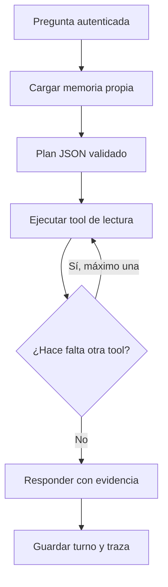
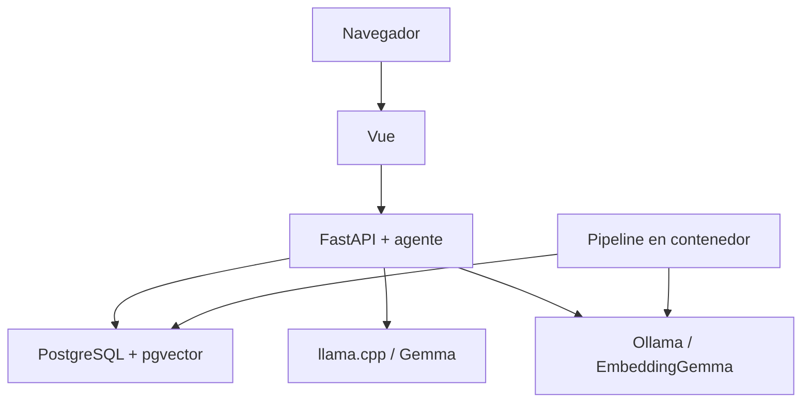
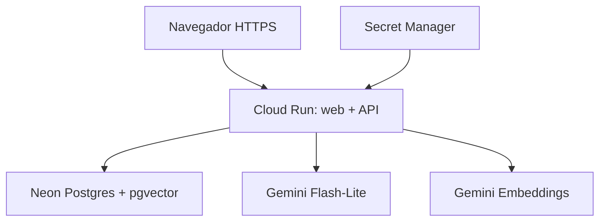

# PRD 3.0 — Agente de investigación de conferencias matutinas

**Tipo:** PRD agregado al PRD 2.0 existente  
**Estado:** listo para aprobación e implementación  
**Fecha de corte:** 5 de septiembre de 2026  
**Fecha límite de entrega:** 5 de septiembre de 2026, 23:59, hora de Ciudad de México  
**Repositorio de partida:** [AH-Practica1-ArquitecturaMedallonMaNaneras](https://github.com/angeles-ricardo-89/AH-Practica1-ArquitecturaMedallonMaNaneras)  
**Audiencia principal:** periodistas y analistas que necesitan localizar evidencia verificable

---

## 1. Decisión de producto

El proyecto evolucionará de un chat RAG con flujo fijo a un agente de investigación acotado. El agente ayudará a responder dos preguntas de trabajo concretas:

1. ¿Qué se declaró sobre una persona o tema, y cuál es la evidencia exacta?
2. ¿Qué temas y grupos temáticos emergen del corpus, y qué declaraciones los representan?

El valor no estará en que el modelo “sepa más”, sino en que pueda decidir cómo investigar dentro del corpus, usar herramientas de lectura especializadas, conservar el hilo de una investigación y mostrar la evidencia que sustenta cada respuesta.

La solución conservará la arquitectura medallón y las piezas que ya funcionan. No se migrará a LangChain, LangGraph ni a otro framework generalista durante la ruta crítica. Se añadirá una capa pequeña de planificación, ejecución segura de herramientas y síntesis sobre FastAPI, Pydantic, PostgreSQL/pgvector y los proveedores de modelos ya definidos.

## 2. Problema que se resuelve

Las transcripciones presidenciales contienen una gran cantidad de declaraciones dispersas entre fechas, participantes y temas. Una búsqueda convencional puede encontrar fragmentos parecidos, pero no siempre ayuda a:

- continuar una investigación durante varios turnos;
- distinguir una sesión de otra;
- explorar temas que surgieron automáticamente en el corpus;
- explicar qué herramienta se utilizó y qué evidencia se recuperó;
- evitar conclusiones cuando el corpus no contiene respaldo suficiente.

El producto debe reducir el tiempo necesario para localizar declaraciones y convertir resultados dispersos en una respuesta rastreable. El agente no sustituye el criterio periodístico: organiza evidencia del corpus, cita su procedencia y se niega a concluir cuando esa evidencia no existe o es insuficiente.

## 3. Estado actual verificado

El proyecto ya contiene una base valiosa que debe preservarse:

- pipeline medallón Bronze, Silver y Gold;
- FastAPI y Vue 3 con Pinia;
- PostgreSQL con pgvector;
- embeddings locales mediante Ollama y EmbeddingGemma;
- generación local mediante llama.cpp y Gemma;
- búsqueda RAG con filtros temporales;
- agrupamiento UMAP + HDBSCAN y etiquetas de clusters;
- tarjetas de evidencia, observabilidad y pruebas automatizadas.

La memoria está parcialmente preparada, pero no terminada: el contrato del chat acepta `conversation_id` y el constructor de contexto contempla historial, aunque el endpoint no carga ese historial y el frontend no mantiene una conversación persistente. Tampoco existe un catálogo de tools, un ciclo de decisión del agente ni una traza visible de ejecuciones.

### 3.1 Inconsistencias que deben corregirse antes de declarar el producto terminado

| Hallazgo | Riesgo | Corrección obligatoria |
| --- | --- | --- |
| El backend devuelve `prompt`, `completion` y `total`, mientras el frontend espera `total_tokens` | La UI informa consumo incorrecto o vacío | Unificar el contrato y agregar prueba de contrato backend–frontend |
| El backend usa 10,000 tokens de contexto y la UI muestra 8,192 | El usuario recibe una expectativa falsa | Definir un único límite en configuración y exponerlo mediante API autenticada |
| El archivo de evaluación comprometido contiene respuestas de marcador y puntuaciones 0.0, mientras el README presenta la evaluación como terminada | Evidencia académica inválida | Regenerar resultados reales o declarar explícitamente que la evaluación sigue pendiente |
| `IMPLEMENTATION_PLAN.md` conserva trabajo pendiente que el README presenta como concluido | Estado del proyecto poco confiable | Sincronizar README, plan y evidencia de pruebas |
| El modelo generativo aparece como `gemma-4-12b`, `gemma4` y Gemma4-26B según el archivo consultado | Ejecución no reproducible | Definir un identificador canónico y documentar el archivo GGUF usado |
| La plantilla de entorno menciona un embedding distinto al valor efectivo EmbeddingGemma | Una instalación nueva puede construir un índice incompatible | Corregir plantilla, documentación y validación al arrancar |
| Algunos filtros se aplican después de recuperar el top-k vectorial | Se pueden perder evidencias relevantes antes de filtrar | Prefiltrar en SQL cuando haya fecha o participante, y después ordenar por similitud |

No se aceptará ocultar estas inconsistencias en la documentación. El PDF final debe distinguir claramente lo implementado, lo probado y lo diferido.

## 4. Objetivos del MVP

### 4.1 Objetivos obligatorios

- Mantener conversaciones persistentes durante 30 días desde su última actividad.
- Permitir crear, listar, retomar y borrar conversaciones.
- Aislar de forma demostrable la memoria entre conversaciones y entre usuarios.
- Autenticar con JWT guardado en cookie `HttpOnly` y `SameSite=Strict`.
- Precargar dos usuarios demo y entregar sus credenciales únicamente en el PDF.
- Proteger todo el dashboard y la API, excepto la pantalla/operación de login y `GET /health`.
- Incorporar exactamente tres tools de investigación, todas de solo lectura.
- Ejecutar el agente local completamente offline con los modelos locales actuales.
- Mantener EmbeddingGemma para el corpus local.
- Construir un corpus productivo independiente con Gemini Embeddings y Neon.
- Containerizar y verificar localmente el pipeline medallón completo.
- Publicar una URL funcional en GCP; primero la URL administrada de Cloud Run.
- Aplicar controles priorizados de OWASP Top 10:2025 y OWASP Top 10 for LLM Applications 2026.
- Negarse a concluir cuando no exista evidencia suficiente en el corpus.

### 4.2 No objetivos del MVP

- Registro público de usuarios.
- Aprobación de registros mediante Telegram.
- Búsqueda abierta en Internet.
- Ejecución de SQL generado por el modelo.
- Modificación del corpus desde el agente.
- Ejecución del pipeline desde el chat.
- Memoria global o perfil permanente del usuario.
- Agentes autónomos que actúen fuera de una solicitud explícita.
- Migración completa a LangChain, LangGraph, Google ADK o PydanticAI.
- Pipeline productivo completo en GCP; se realizará solo si sobra tiempo.
- Dominio personalizado antes de disponer de una URL de Cloud Run verificada.

## 5. Experiencia esperada

### 5.1 Flujo principal

1. El usuario inicia sesión.
2. Crea una conversación o retoma una propia.
3. Pregunta por una persona, declaración o tema.
4. El agente decide si debe buscar declaraciones, explorar temas o consultar un cluster.
5. El backend valida la decisión, ejecuta como máximo dos tools y devuelve resultados acotados.
6. El agente redacta una respuesta con citas y una explicación breve de las herramientas usadas.
7. La pregunta, respuesta, evidencias y trazas se guardan en la conversación del usuario.
8. El usuario puede continuar el hilo o borrar toda la conversación.

### 5.2 Comportamiento sin evidencia

Si ninguna evidencia supera el umbral definido, el agente debe responder en términos equivalentes a:

> No encontré evidencia suficiente en el corpus para sostener esa conclusión.

Puede sugerir reformular la búsqueda o ampliar fechas, pero no debe completar la respuesta con conocimiento general, búsqueda web ni suposiciones.

### 5.3 Cambios mínimos de interfaz

- pantalla de login;
- menú de conversaciones con crear, retomar y borrar;
- indicador claro de la conversación activa;
- tarjeta compacta “Cómo investigó” con nombre de cada tool, filtros aplicados, cantidad de resultados y duración;
- tarjetas de evidencia ya existentes, conservando fecha, participante, fragmento y enlace de origen;
- aviso en producción: el nivel gratuito de Gemini puede usar los datos enviados para mejorar productos de Google y no deben introducirse investigaciones confidenciales;
- mensajes claros para sesión expirada, límite de uso, servicio de modelo no disponible y ausencia de evidencia.

## 6. Capa agéntica propuesta

La capa agéntica será deliberadamente pequeña y auditable:

### 6.1 Ciclo del agente

- **Planificador:** Gemma local o Gemini productivo devuelve JSON con `tool_name`, argumentos y motivo breve.
- **Validador:** Pydantic rechaza nombres, tipos, rangos o filtros no permitidos.
- **Ejecutor:** llama servicios internos existentes; nunca ejecuta código o SQL proporcionado por el modelo.
- **Sintetizador:** redacta únicamente con la memoria autorizada y los resultados de tools.
- **Guardas:** máximo dos ejecuciones por mensaje, tiempo máximo por tool, límite de filas y límite total de contexto.

Si el modelo local no emite un plan válido, se realizará un segundo intento con instrucciones de reparación. Si vuelve a fallar, el backend aplicará un fallback seguro hacia `buscar_declaraciones` con la consulta original. El fallback se mostrará en la traza; no se simulará una decisión exitosa del modelo.

## 7. Tools seleccionadas

### 7.1 `buscar_declaraciones`

**Problema que atiende:** localizar qué se dijo sobre una persona o tema.  
**Entradas:** consulta, fecha inicial opcional, fecha final opcional, participante opcional y `top_k` entre 1 y 8.  
**Salida:** identificador de evidencia, texto, fecha, participante, conferencia, URL y puntuación de similitud.  
**Regla:** los filtros relacionales se aplican antes del ranking vectorial cuando estén presentes.

### 7.2 `explorar_temas`

**Problema que atiende:** descubrir temas sin exigir que el usuario conozca las etiquetas existentes.  
**Entradas:** texto temático opcional y límite entre 1 y 5.  
**Salida:** identificador del cluster, etiqueta, términos representativos, tamaño, cohesión y rango de fechas.  
**Regla:** sin consulta, devuelve clusters relevantes por tamaño y calidad, evitando que el ruido sea presentado como tema.

### 7.3 `consultar_cluster`

**Problema que atiende:** explicar un tema mediante declaraciones representativas.  
**Entradas:** identificador de cluster validado y límite entre 1 y 8.  
**Salida:** metadatos del cluster y evidencias representativas ordenadas por fuerza de pertenencia, diversidad temporal y calidad.  
**Regla:** un cluster nunca se presentará como hecho; solo como agrupación algorítmica acompañada por evidencia.

### 7.4 Evaluación de tools descartadas o diferidas

| Candidata | Valor | Esfuerzo/riesgo | Decisión |
| --- | --- | --- | --- |
| Línea de tiempo temática | Alto para análisis longitudinal | Requiere agrupación, orden, deduplicación y nuevas pruebas | Diferir a P1; puede aproximarse con búsqueda por fechas |
| Comparar personas o periodos | Alto | Multiplica búsquedas, contexto y riesgo de conclusiones débiles | Diferir a P1 |
| Exportar expediente | Medio | Es una acción de interfaz, no una capacidad de razonamiento | Diferir como botón de exportación |
| Panorama de una conferencia | Medio | La búsqueda con filtro de fecha ya cubre gran parte del caso | No crear tool separada en MVP |
| Búsqueda web | Alto alcance, baja trazabilidad para este producto | Prompt injection externa, nuevas fuentes y pérdida del límite del corpus | Rechazar |
| SQL libre | Flexibilidad aparente | Inyección, exfiltración, carga no acotada y agencia excesiva | Rechazar |
| Actualizar corpus | Operación útil | Mezcla conversación con escritura y puede contaminar datos | Rechazar |
| Ejecutar pipeline | Valor operativo, no periodístico | Agencia excesiva y consumo no controlado | Rechazar |
| Telegram | Útil para un registro futuro | No aporta a los dos trabajos principales ni a la rúbrica inmediata | Diferir después de la entrega |

## 8. Memoria conversacional

### 8.1 Alcance

La memoria contiene solo el historial de una conversación. No habrá recuerdos compartidos entre conversaciones ni un perfil persistente del usuario.

### 8.2 Modelo mínimo de datos

- `app_user`: usuario demo, hash de contraseña, estado y fechas.
- `conversation`: propietario, título, creación, última actividad y expiración.
- `message`: conversación, propietario redundante para control, rol, contenido, tokens, modelo y fecha.
- `tool_execution`: conversación, turno, tool, argumentos saneados, cantidad de resultados, duración, estado y fecha.

Las relaciones deberán usar borrado en cascada. Los identificadores públicos de conversación serán opacos y coherentes con la regla del proyecto de no usar UUID aleatorios; pueden derivarse mediante HMAC de un identificador interno y un secreto del servidor.

### 8.3 Aislamiento obligatorio

- El `user_id` siempre se obtiene del JWT validado, nunca del cuerpo o query string.
- Toda lectura, actualización o borrado de conversación incluye simultáneamente `conversation_id` y `user_id`.
- Una conversación ajena responde `404`, no `403`, para no confirmar su existencia.
- El frontend no envía el historial completo; solo envía la pregunta y el identificador de conversación. El servidor carga el historial autorizado.
- Las trazas y evidencias heredarán el propietario de la conversación.

### 8.4 Retención y borrado

- Retención: 30 días desde la última actividad.
- Cada turno válido actualiza `last_activity_at` y `expires_at`.
- Un proceso programado o limpieza oportunista elimina conversaciones vencidas.
- El borrado solicitado por el usuario elimina inmediatamente conversación, mensajes y trazas.
- No se conservará el contenido borrado en logs de aplicación.

## 9. Autenticación y control de acceso

### 9.1 Flujo

- Dos usuarios demo se crean de forma idempotente desde variables protegidas.
- Las contraseñas se almacenan con Argon2 mediante `pwdlib`.
- El JWT se firma con HS256 y un secreto de al menos 256 bits.
- Claims mínimos: `sub`, `iat`, `exp`, `iss` y `aud`.
- Duración inicial: 60 minutos, sin refresh token en el MVP.
- Cookie de producción: `HttpOnly`, `Secure`, `SameSite=Strict`, `Path=/` y sin atributo `Domain`.
- Cookie local: igual, excepto `Secure=false` para HTTP local.
- Login y logout devuelven cuerpos mínimos; logout elimina la cookie.
- Las respuestas de autenticación no distinguen entre usuario inexistente y contraseña incorrecta.

### 9.2 Protección CSRF

Al usar JWT en cookie, todas las operaciones que cambian estado deberán validar origen y un token CSRF enviado en encabezado. El token se entrega al completar el login y queda vinculado a la sesión. `SameSite` es una defensa adicional, no el único control.

### 9.3 Superficie pública

- Público: pantalla y operación de login; `GET /health` con respuesta mínima.
- Protegido: todo el resto de `/api`, dashboard, conversaciones, chat, clusters, métricas y logs.
- En producción, OpenAPI y Swagger se deshabilitan o requieren autenticación.
- Los archivos estáticos pueden descargarse, pero ninguna información del dashboard se obtiene sin una API autenticada.

## 10. Rate limits y control de consumo

Los límites se aplican en backend y serán configurables:

| Recurso | Límite inicial |
| --- | --- |
| Login | 5 intentos por minuto por combinación de IP y usuario; bloqueo progresivo |
| Chat/agente | 10 solicitudes por minuto por usuario |
| Cuota diaria | 100 solicitudes de agente por usuario |
| Tools | 2 ejecuciones por mensaje |
| Búsqueda | 8 evidencias por ejecución |
| Exploración | 5 clusters por ejecución |
| Cuerpo de pregunta | 2,000 caracteres |
| Tiempo de tool | 10 segundos |
| Tiempo total de respuesta | 60 segundos |

El contador productivo debe ser compartido y atómico. Para evitar Redis y otro servicio, se almacenarán ventanas de consumo en PostgreSQL/Neon mediante `INSERT ... ON CONFLICT DO UPDATE`. Las direcciones IP se guardarán como HMAC, no en claro. Los contadores se depurarán automáticamente.

Una respuesta limitada devuelve HTTP `429` con `Retry-After`. Ningún error, reinicio del modelo o reintento interno debe consumir llamadas ilimitadas. Cloud Run se configura inicialmente con máximo una instancia para controlar coste y simplificar el comportamiento; el límite seguirá almacenado en base de datos para sobrevivir reinicios.

## 11. Arquitectura objetivo

### 11.1 Local: fuente de verdad para desarrollo y demostración

- Docker Compose orquesta frontend, backend, PostgreSQL y un servicio/perfil `pipeline`.
- El mismo código de pipeline ejecuta Bronze → Silver → Gold → clustering → etiquetado.
- Ollama y llama.cpp pueden permanecer como runtimes locales del host por la dependencia de GPU y pesos; serán dependencias explícitas con health checks, no pasos manuales ocultos.
- Debe existir un comando único de verificación, por ejemplo `make docker-verify`, que use una muestra Bronze congelada y compruebe que las capas producen salidas válidas.
- Debe existir un comando documentado para ejecutar el pipeline completo contra el corpus real.
- La demostración local del agente no realiza llamadas a Gemini ni a otros servicios externos.

### 11.2 Producción mínima

- Un solo servicio de Cloud Run servirá el build de Vue y FastAPI bajo el mismo origen. Esto reduce CORS, simplifica cookies y minimiza coste sin mezclar las capas lógicas del código.
- Configuración inicial: facturación por solicitud, escala a cero, 1 vCPU, memoria ajustada después de una prueba, concurrencia 10 y máximo una instancia.
- Neon usa conexión agrupada y TLS obligatorio.
- Secret Manager guarda `DATABASE_URL`, `GEMINI_API_KEY`, secreto JWT y valores de usuarios demo. Deben mantenerse dentro de seis versiones activas para aprovechar su nivel gratuito.
- Modelo generativo inicial: `gemini-3.5-flash-lite`.
- Modelo de embeddings: `gemini-embedding-001`, 768 dimensiones, normalización explícita y tareas `RETRIEVAL_DOCUMENT` / `RETRIEVAL_QUERY`.
- La URL `run.app` validada es el requisito de entrega. El dominio propio se configura después; no puede bloquear la publicación.

### 11.3 Separación de corpus

Los vectores de EmbeddingGemma y Gemini nunca se mezclan, aunque tengan 768 dimensiones. Cada entorno registra como metadatos obligatorios:

- proveedor y modelo;
- dimensión;
- tipo de tarea;
- versión del formato de texto embebido;
- fecha de construcción;
- hash del corpus.

Producción se construye mediante una reindexación total hacia Neon. El servicio debe fallar al iniciar si la configuración de consulta no coincide con los metadatos del índice.

## 12. Evaluación de librerías y microframeworks

| Opción | Aporte real | Coste de integración | Decisión |
| --- | --- | --- | --- |
| FastAPI + Pydantic existentes | Ya resuelven API, dependencias, validación y esquemas del plan | Bajo | **Usar como orquestador del agente** |
| `google-genai` | SDK oficial único para generación y embeddings Gemini | Bajo y aislado en adaptadores | **Agregar solo para producción** |
| PyJWT + `pwdlib[argon2]` | Implementación directa, documentada por FastAPI, sin imponer ORM | Bajo | **Agregar para autenticación** |
| PydanticAI | Tools, historial y proveedores listos | Medio; la ganancia depende de tool calling local no demostrado | No usar en P0; reconsiderar después de la entrega |
| Google ADK | Sesiones, tools y despliegue a Cloud Run | Alto; duplica memoria y cambia el modelo de ejecución actual | Rechazar en la ruta crítica |
| LangChain / LangGraph | Ecosistema amplio y grafos de agentes | Alto; migración, nuevas abstracciones y superficie de errores | Rechazar en la ruta crítica |
| Instructor | Facilita salidas estructuradas | Bajo-medio, pero Pydantic + reparación ya cubre este caso | No agregar |
| FastAPI Users | Flujos completos de usuarios | Medio-alto sin ORM actual y excesivo para dos usuarios demo | No agregar |
| SlowAPI / Redis | Rate limiting conocido | Redis agrega infraestructura; memoria local no sobrevive reinicios | No agregar; usar contador atómico en PostgreSQL |

Esta decisión evita “poner framework por poner framework”. El sistema será agéntico porque el modelo elegirá herramientas dentro de límites verificables, no porque importe una biblioteca con la palabra agent.

## 13. Seguridad mínima no negociable

### 13.1 OWASP Top 10:2025

| Riesgo relevante | Control del MVP |
| --- | --- |
| A01 Broken Access Control | Propiedad de conversación derivada del JWT; consultas siempre por usuario + conversación; pruebas cruzadas |
| A02 Security Misconfiguration | Configuración separada local/prod; docs deshabilitadas; CORS de origen exacto; headers seguros |
| A03 Software Supply Chain Failures | `uv.lock` y `pnpm-lock.yaml`; versiones fijadas; revisión de dependencias; imagen base fijada |
| A04 Cryptographic Failures | TLS; cookies seguras; secretos fuera del repositorio; Argon2; JWT con secreto fuerte |
| A05 Injection | SQL parametrizado; ninguna tool acepta SQL; texto del corpus tratado como datos |
| A06 Insecure Design | Tools de solo lectura, dos pasos máximos, sin acciones externas y borrado por usuario |
| A07 Authentication Failures | Mensajes genéricos, límites de login, expiración y revocación práctica por cookie |
| A08 Software or Data Integrity Failures | Hashes y metadatos de corpus/modelo; pipeline reproducible e idempotente |
| A09 Security Logging and Alerting Failures | Eventos de login, 401/403/429, tool y errores; sin tokens, contraseñas ni texto completo |
| A10 Mishandling of Exceptional Conditions | Fallar cerrado; timeouts; 503/429 claros; sin fallback a respuestas sin evidencia |

### 13.2 OWASP Top 10 for LLM Applications 2026

| Riesgo | Control del MVP |
| --- | --- |
| LLM01 Prompt Injection | Separar instrucciones, memoria, corpus y resultados; ignorar instrucciones encontradas dentro del corpus; tools allowlist |
| LLM02 Sensitive Information Disclosure | No incluir secretos en prompts; historial por propietario; logs sin contenido; aviso sobre Gemini gratuito |
| LLM03 Excessive Agency | Tres tools de lectura, parámetros estrictos, máximo dos ejecuciones y sin efectos externos |
| LLM04 Supply Chain | Dependencias mínimas, bloqueadas y escaneadas; no instalar plugins dinámicos |
| LLM05 Data and Model Poisoning | Bronze inmutable, hashes, procedencia, validación y reconstrucción controlada de Gold |
| LLM06 Unbounded Consumption | Rate limits, cuotas, top-k, tokens, timeouts, reintentos e instancias máximas |
| LLM07 Misinformation | Respuesta ligada a evidencias; negativa explícita; clusters descritos como agrupaciones, no hechos |
| LLM08 Hidden Context Exposure | El sistema no revela prompts, secretos ni memoria de otras conversaciones; errores saneados |
| LLM09 Vector and Embedding Weaknesses | Índices separados; metadatos del modelo; filtros previos; umbral y evaluación de recuperación |
| LLM10 Improper Output Handling | La UI escapa Markdown/HTML; URLs se validan contra orígenes permitidos; salida del modelo nunca se ejecuta |

Controles complementarios: CSP restrictiva, `X-Content-Type-Options: nosniff`, `Referrer-Policy`, HSTS en producción, límites de tamaño, timeouts de base de datos, respuestas sin stack traces y escaneo de secretos antes de publicar.

## 14. API mínima

| Método y ruta | Uso | Acceso |
| --- | --- | --- |
| `GET /health` | Disponibilidad mínima, sin detalles sensibles | Público |
| `POST /auth/login` | Crear cookie JWT y token CSRF | Público, limitado |
| `POST /auth/logout` | Borrar cookie | Autenticado + CSRF |
| `GET /auth/me` | Identidad activa | Autenticado |
| `GET /conversations` | Listar conversaciones propias no vencidas | Autenticado |
| `POST /conversations` | Crear conversación | Autenticado + CSRF |
| `GET /conversations/{id}` | Recuperar conversación e historial propio | Autenticado |
| `DELETE /conversations/{id}` | Borrar conversación en cascada | Autenticado + CSRF |
| `POST /conversations/{id}/messages` | Ejecutar un turno del agente | Autenticado + CSRF + límites |

Las tools serán funciones internas, no endpoints invocables libremente desde el navegador.

## 15. Criterios de aceptación

### 15.1 Autenticación

- CA-A01: credenciales válidas crean cookie JWT `HttpOnly`; credenciales inválidas devuelven el mismo mensaje.
- CA-A02: en producción la cookie incluye `Secure` y `SameSite=Strict`.
- CA-A03: cualquier endpoint no público devuelve `401` sin cookie válida.
- CA-A04: el dashboard redirige a login cuando la sesión vence.
- CA-A05: 6 intentos de login dentro de un minuto activan `429` o el bloqueo definido.
- CA-A06: ninguna contraseña, JWT o API key aparece en repositorio, respuesta o logs.

### 15.2 Memoria y aislamiento

- CA-M01: un usuario puede crear dos conversaciones y retomar cada una con su historial correcto.
- CA-M02: una referencia mencionada solo en la conversación A no aparece al preguntar en la conversación B.
- CA-M03: el usuario 2 no puede listar, leer, continuar ni borrar una conversación del usuario 1.
- CA-M04: los intentos cruzados por identificador devuelven `404`.
- CA-M05: borrar una conversación elimina mensajes y trazas y deja de aparecer en el listado.
- CA-M06: una conversación con más de 30 días de inactividad se elimina o deja de estar disponible tras la tarea de limpieza.

### 15.3 Agente y tools

- CA-T01: preguntas sobre una persona o tema invocan `buscar_declaraciones` y muestran evidencia.
- CA-T02: una solicitud de temas generales invoca `explorar_temas`.
- CA-T03: una pregunta de seguimiento sobre un cluster invoca `consultar_cluster` y usa su contexto.
- CA-T04: ninguna respuesta ejecuta más de dos tools.
- CA-T05: nombres o argumentos de tool no permitidos son rechazados antes de acceder a datos.
- CA-T06: una inyección dentro de una transcripción no cambia instrucciones ni habilita nuevas tools.
- CA-T07: sin evidencia suficiente, el agente se niega a concluir.
- CA-T08: cada respuesta muestra tool, filtros, cantidad de resultados, latencia y evidencias utilizadas.

### 15.4 RAG y corpus

- CA-R01: los filtros de fecha/participante se aplican antes del ranking cuando corresponda.
- CA-R02: se regenera una evaluación real; no se aceptan textos de marcador ni puntuaciones fabricadas.
- CA-R03: la evaluación reporta por separado recuperación, fidelidad, relevancia y tasa de negativas correctas.
- CA-R04: se conserva como meta mínima declarada fidelidad ≥90% y relevancia ≥80%, o se documenta con honestidad el resultado real y sus límites.
- CA-R05: producción rechaza iniciar si el modelo/dimensión/tipo de tarea configurado no coincide con el índice Neon.
- CA-R06: los embeddings locales y productivos permanecen físicamente separados.

### 15.5 Docker y producción

- CA-D01: una instalación limpia puede levantar la aplicación local con instrucciones reproducibles.
- CA-D02: el pipeline completo se ejecuta desde un contenedor y deja evidencia verificable de Bronze, Silver y Gold.
- CA-D03: una prueba con fixture puede validar el pipeline sin descargar de nuevo todo el corpus.
- CA-D04: la URL de Cloud Run abre login, autentica, permite conversar, retomar y borrar.
- CA-D05: `/health` funciona sin autenticación y no revela secretos ni topología interna.
- CA-D06: una prueba productiva con ambos usuarios demuestra aislamiento.
- CA-D07: Neon exige TLS y usa conexión agrupada.
- CA-D08: el servicio escala a cero y tiene máximo de instancias configurado.

## 16. Pruebas obligatorias

- Unitarias para claims JWT, expiración, hashing, CSRF y validación de tools.
- Integración con PostgreSQL vivo para propiedad y borrado de conversaciones.
- Matriz de aislamiento: 2 usuarios × 2 conversaciones × leer/continuar/borrar.
- Contrato backend–frontend para tokens, errores y respuestas del agente.
- Pruebas de prompts maliciosos en pregunta, memoria y corpus recuperado.
- Pruebas de límites de login, chat, cuota diaria, resultados y pasos.
- Prueba del agente local sin red hacia Gemini.
- Smoke test de producción ejecutado desde una sesión limpia.
- Cobertura backend mínima de 90%, `ruff`, `ty`, typecheck y pruebas frontend conforme a las reglas existentes del repositorio.

## 17. Plan de ejecución y línea de corte

El orden es deliberado: cada bloque deja un incremento demostrable. No se inicia el siguiente si el anterior rompe el RAG actual.

### P0.1 — Verdad del proyecto

- corregir contratos, límites y nombres de modelos;
- regenerar o marcar correctamente la evaluación;
- crear especificación y plan conforme a `AGENTS.md`;
- ejecutar suite actual y guardar línea base.

**Salida:** el sistema existente sigue funcionando y la documentación deja de contradecir al código.

### P0.2 — Autenticación y aislamiento

- migraciones de usuarios, conversaciones, mensajes, trazas y contadores;
- dos usuarios demo idempotentes;
- cookie JWT, CSRF, route guards y protección global;
- pruebas cruzadas entre usuarios.

**Salida:** ninguna sesión o API privada es accesible sin identidad válida.

### P0.3 — Memoria útil

- endpoints crear/listar/retomar/borrar;
- persistencia de mensajes;
- carga de historial desde servidor y límite de contexto;
- UI de conversaciones y retención de 30 días.

**Salida:** dos conversaciones del mismo usuario recuerdan sus propios hilos sin mezclarse.

### P0.4 — Agente con tres tools

- modelos Pydantic de plan y resultados;
- catálogo allowlist;
- implementación y pruebas de las tres tools;
- ciclo planificar → ejecutar → sintetizar;
- traza visible y negativa sin evidencia.

**Salida:** demostración offline de los dos trabajos periodísticos principales.

### P0.5 — Docker verificable

- servicio/perfil de pipeline;
- health checks y configuración para acceder a modelos locales;
- fixture y comando único de verificación;
- documentación de volúmenes, dependencias y recuperación ante fallo.

**Salida:** evidencia reproducible del pipeline medallón en contenedor.

### P0.6 — Producción mínima

- crear proyecto GCP, asociar facturación y activar APIs necesarias;
- crear Neon y extensiones/esquemas;
- re-embebido completo con Gemini hacia un índice independiente;
- imagen única web + API, secretos y despliegue Cloud Run;
- smoke test y prueba de aislamiento con ambos usuarios.

**Salida:** URL pública funcional para la entrega.

### P0.7 — Evidencia académica

- PDF en lenguaje accesible centrado en problema, usuario, decisiones y resultados;
- arquitectura local/productiva;
- capturas de login, memoria, tool trace, negativa sin evidencia y aislamiento;
- comandos de reproducción y resultados reales de pruebas;
- credenciales de ambos usuarios solo en el PDF.

### P1 — Solo después de cumplir P0

- dominio personalizado;
- línea de tiempo o comparación de periodos;
- pipeline completo ejecutado en GCP;
- endurecimiento con una segunda instancia y pruebas distribuidas.

### P2 — Después de la entrega y con aprobación explícita

- registro público;
- bot de Telegram para aprobar o rechazar solicitudes;
- administración de usuarios y revocación avanzada.

Si el tiempo se agota, se elimina P1 completo. Nunca se recortan autenticación, aislamiento, negativa sin evidencia, tres tools, memoria, Docker verificable, URL activa o pruebas mínimas.

## 18. Demostración de cinco minutos

1. Abrir la URL y mostrar que el dashboard redirige al login.
2. Entrar como usuario demo 1 y crear “Investigación energía”.
3. Preguntar qué se declaró sobre el tema; mostrar `buscar_declaraciones`, citas y trazas.
4. Pedir temas relacionados; mostrar `explorar_temas` y luego `consultar_cluster`.
5. Crear una segunda conversación y demostrar que no conoce el contexto de la primera.
6. Entrar como usuario demo 2 e intentar abrir la URL de conversación del usuario 1; mostrar `404`.
7. Consultar un asunto sin respaldo; mostrar la negativa a concluir.
8. Borrar una conversación y comprobar que ya no se puede recuperar.

## 19. Riesgos y mitigaciones

| Riesgo | Probabilidad/impacto | Mitigación |
| --- | --- | --- |
| Gemma local no produce JSON válido | Media/alta | Esquema pequeño, un reintento y fallback seguro trazable |
| Tool calling nativo no soportado por el servidor local | Alta/media | Plan JSON validado, sin depender de tool calling nativo |
| Abuso de cuentas demo | Media/alta | Credenciales solo en PDF, cuotas por usuario, login limitado, máximo una instancia |
| Nivel gratuito de Gemini procesa consultas sensibles | Media/alta | Aviso visible, prohibición de datos confidenciales, logs mínimos y borrado; migrar a pago si cambia el uso |
| Reindexación Gemini incompleta | Media/alta | Índice/versionado nuevo, conteos y checksum antes de activar producción |
| Cloud Run o Neon exceden nivel gratuito | Baja/media para demo | escala a cero, máximo una instancia, cuotas y alertas; no prometer coste exactamente cero |
| Configurar dominio consume tiempo | Media/media | entregar primero URL `run.app`; dominio pasa a P1 |
| Documentación vuelve a sobreafirmar resultados | Media/alta | anexar salidas reales de pruebas y marcar explícitamente lo diferido |

## 20. Presupuesto operativo objetivo

La meta es aproximarse a USD 0 para la demo, no garantizarlo:

- Cloud Run dispone de nivel gratuito mensual para CPU, memoria y solicitudes con facturación por petición.
- Neon ofrece plan gratuito y escala a cero; debe vigilarse su cuota de cómputo.
- Gemini Flash-Lite y Gemini Embeddings disponen de nivel gratuito, con el aviso de uso de datos ya aceptado para esta demo.
- Secret Manager permite hasta seis versiones activas y 10,000 accesos mensuales gratuitos.

Se configurarán alertas de presupuesto; una alerta informa, pero no constituye un corte automático. La cuota diaria de aplicación y `max-instances=1` son los controles efectivos contra consumo inesperado.

## 21. Indicaciones mínimas no negociables

1. No mezclar embeddings de modelos diferentes.
2. No enviar historial aportado por el navegador al modelo; cargarlo desde el servidor después de comprobar propiedad.
3. No aceptar `user_id`, SQL, nombre libre de tool ni URL externa desde el modelo.
4. No permitir más de dos ejecuciones de tool por mensaje.
5. No responder una conclusión sin evidencias citables del corpus.
6. No exponer dashboard, clusters, métricas, logs ni chat sin JWT válido.
7. No almacenar JWT en `localStorage`; usar cookie `HttpOnly` + `SameSite=Strict`.
8. No confiar solo en `SameSite`; validar CSRF en operaciones con estado.
9. No publicar contraseñas ni secretos en Git, login, logs o capturas públicas.
10. No declarar evaluaciones o pruebas como aprobadas si contienen marcadores o no fueron ejecutadas.
11. No bloquear la entrega por dominio, Telegram, registro público o pipeline productivo.
12. No publicar hasta demostrar aislamiento entre dos usuarios y entre dos conversaciones.
13. No considerar terminado el agente si sus tools y evidencias no son visibles y verificables.
14. No considerar containerizado el pipeline si requiere ejecutar sus etapas manualmente fuera del contenedor.
15. No sacrificar la URL activa, la autenticación, la memoria o las pruebas mínimas por agregar más features.

## 22. Definición de terminado

El proyecto está listo para entregar cuando existe una URL pública estable y, mediante los dos usuarios demo, se demuestra que:

- el acceso privado requiere autenticación;
- la memoria puede crearse, retomarse y borrarse;
- no hay cruces entre usuarios ni conversaciones;
- el agente selecciona y ejecuta las tres tools de lectura;
- cada conclusión incluye evidencia rastreable;
- el agente se niega a responder sin respaldo;
- el pipeline medallón puede ejecutarse y verificarse en Docker local;
- el corpus productivo usa exclusivamente embeddings Gemini compatibles entre sí;
- las pruebas y métricas presentadas son resultados reales;
- el PDF explica el problema y el valor para periodistas antes que los detalles técnicos.

## 23. Fuentes primarias consultadas

- [Repositorio y PRD 2.0 actuales](https://github.com/angeles-ricardo-89/AH-Practica1-ArquitecturaMedallonMaNaneras/blob/main/docs/prd/arquitectura_medallon_y_embbeding_CSP.md)
- [Reglas operativas actuales del repositorio](https://github.com/angeles-ricardo-89/AH-Practica1-ArquitecturaMedallonMaNaneras/blob/main/AGENTS.md)
- [Google Skills — referencia oficial de patrones para Cloud Run y Gemini](https://github.com/google/skills)
- [FastAPI: JWT y hashing de contraseñas](https://fastapi.tiangolo.com/tutorial/security/oauth2-jwt/)
- [Gemini Developer API: precios y tratamiento del nivel gratuito](https://ai.google.dev/gemini-api/docs/pricing)
- [Gemini Embeddings: tipos de tarea, dimensiones e incompatibilidad entre espacios](https://ai.google.dev/gemini-api/docs/embeddings)
- [Cloud Run: precios y nivel gratuito](https://cloud.google.com/run/pricing)
- [Cloud Run: opciones de dominio personalizado](https://cloud.google.com/run/docs/mapping-custom-domains)
- [Secret Manager: precios y nivel gratuito](https://cloud.google.com/secret-manager/pricing)
- [Neon: plan y precios](https://neon.com/pricing)
- [Neon: extensión pgvector](https://neon.com/docs/extensions/pgvector)
- [Neon: conexión agrupada](https://neon.com/docs/connect/connection-pooling)
- [OWASP Top 10:2025](https://owasp.org/Top10/2025/)
- [OWASP Top 10 for LLM Applications 2026 — archivos finales](https://github.com/GenAI-Security-Project/GenAI-LLM-Top10/tree/main/2026/final)
- [OWASP Top 10 for Agentic Applications 2026](https://genai.owasp.org/resource/owasp-top-10-for-agentic-applications-for-2026/)

---

**Decisión final:** construir un agente estrecho, verificable y seguro que investigue mejor el corpus existente. La entrega se gana demostrando evidencia, memoria aislada y funcionamiento real; no acumulando frameworks ni herramientas sin propósito.
