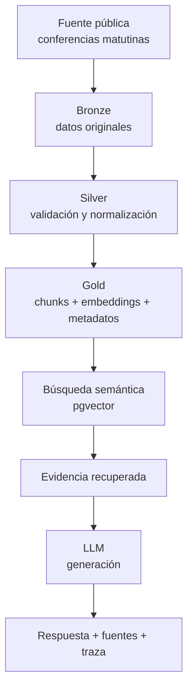
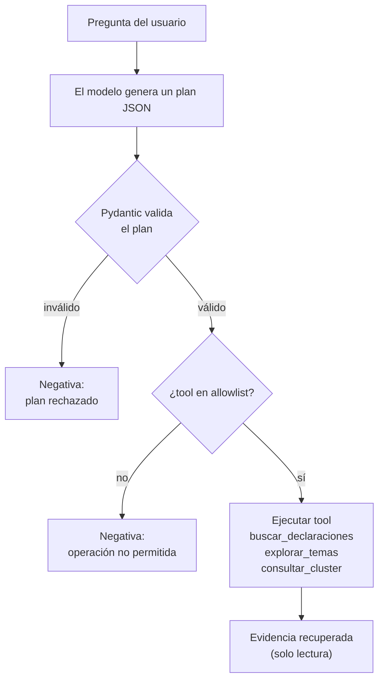
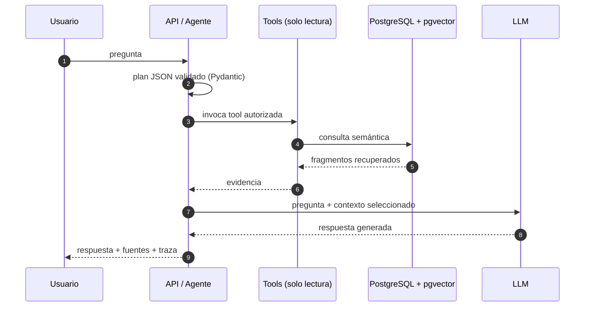
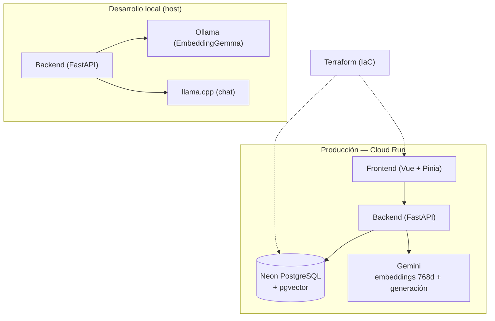
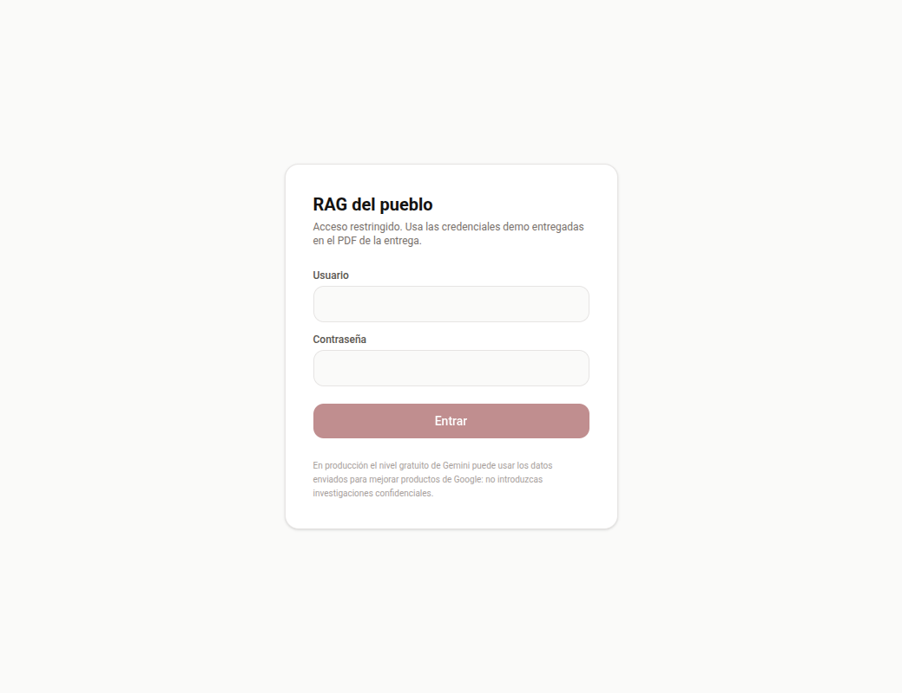
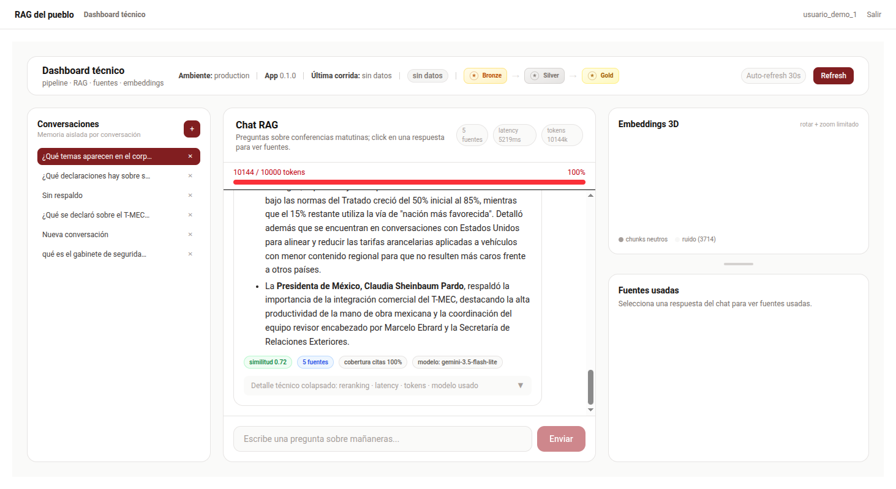
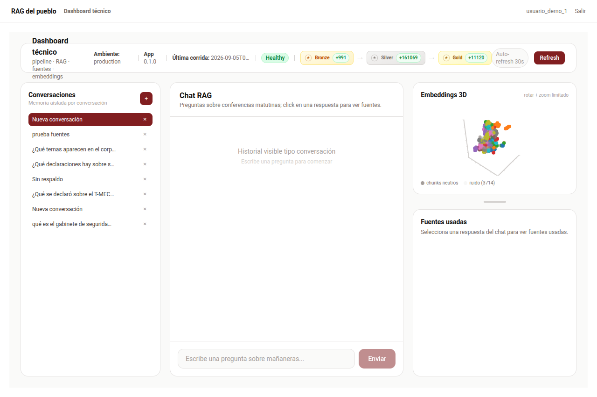
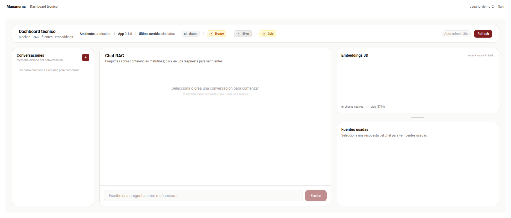

# RAG del pueblo

## Agente de indagación de las conferencias matutinas del Gobierno Federal de México

**Trabajo final — Diplomado de Ingeniería en IA**  
**Reporte de razonamiento y arquitectura**

**Autor:** Ricardo Angeles Gómez

---

## Resumen ejecutivo

Las conferencias matutinas del Gobierno Federal de México constituyen un corpus público,
extenso y temporalmente continuo. Una misma materia puede aparecer en distintas fechas,
ser abordada por diferentes participantes y evolucionar a lo largo del tiempo, lo que hace
difícil localizar manualmente declaraciones específicas y reconstruir su contexto.

**RAG del pueblo** fue construido como un sistema de indagación sobre este corpus. Su
objetivo no es determinar si una declaración es verdadera ni sustituir el análisis humano,
sino facilitar la recuperación de evidencia, conservar su procedencia y generar respuestas
que puedan rastrearse hasta los fragmentos utilizados.

El sistema combina un pipeline de datos con arquitectura medallón
**Bronze → Silver → Gold**, búsqueda semántica mediante embeddings, generación aumentada
por recuperación (RAG), memoria conversacional aislada por usuario y una capa pequeña de
planificación que puede utilizar tres herramientas de consulta de solo lectura.

La arquitectura fue diseñada alrededor de una restricción principal: **una respuesta debe
estar subordinada a la evidencia disponible en el corpus**. Cuando la recuperación no
proporciona respaldo suficiente, el sistema debe abstenerse de presentar una conclusión.

La versión descrita en este reporte se encuentra desplegada en un entorno productivo de
demostración en Cloud Run y utiliza PostgreSQL/pgvector como almacenamiento e índice
vectorial.

**URL productiva:** `https://rag-del-pueblo.tsib.dev`

---

# 1. Contexto y problema

Las conferencias matutinas contienen información distribuida entre miles de fragmentos de
texto. Una búsqueda convencional puede localizar coincidencias léxicas, pero resulta menos
adecuada cuando la pregunta expresa una idea con palabras diferentes a las utilizadas en
la fuente, cuando la información relevante está distribuida entre varias sesiones o cuando
es necesario continuar una investigación durante varios turnos.

El problema planteado para este proyecto fue, por tanto, construir un mecanismo que
permitiera consultar este corpus mediante lenguaje natural sin perder la relación entre una
respuesta generada y las fuentes que la sustentan.

El sistema debía permitir recuperar declaraciones semánticamente relacionadas, mantener el
contexto de una conversación, distinguir conversaciones y usuarios, explorar la estructura
temática del corpus y proporcionar evidencia suficiente para inspeccionar por qué se generó
una determinada respuesta.

El comportamiento esperado ante una consulta sin respaldo también forma parte del problema.
Un sistema de recuperación no debería convertir la ausencia de información en una
afirmación plausible generada por el modelo. Por esta razón, la negativa ante evidencia
insuficiente se considera una característica funcional y no un error.

Los usuarios considerados para esta entrega son periodistas, analistas o investigadores que
necesiten localizar declaraciones y reconstruir su procedencia. La demostración productiva
utiliza dos usuarios independientes para verificar adicionalmente el aislamiento de la
memoria conversacional.

---

# 2. Objetivo y alcance

El objetivo del proyecto es demostrar una arquitectura completa de IA aplicada capaz de
transformar información pública en un corpus consultable mediante recuperación semántica y
generación aumentada por recuperación.

El proyecto cubre cuatro responsabilidades diferentes:

| Responsabilidad | Propósito |
| --- | --- |
| Ingeniería de datos | Ingerir, validar, transformar y conservar el corpus |
| Preparación del conocimiento | Fragmentar, generar embeddings e indexar información |
| Recuperación y generación | Recuperar evidencia y producir respuestas fundamentadas |
| Analítica exploratoria | Identificar agrupaciones temáticas y visualizar el espacio semántico |

Esta separación es importante. Por ejemplo, la reducción dimensional y el clustering son
capacidades analíticas de la capa Gold, pero **no forman parte del camino crítico requerido
para producir una respuesta RAG**.

El sistema tampoco pretende realizar fact-checking, evaluar la veracidad de las
declaraciones, inferir intenciones políticas ni sustituir una investigación periodística.
Su responsabilidad termina en organizar, recuperar y presentar evidencia contenida en el
corpus.

---

# 3. Criterios que guiaron la arquitectura

Las decisiones de diseño se derivaron de cinco necesidades principales: conservar la fuente
original, impedir que registros inválidos contaminaran las etapas posteriores, permitir
búsqueda semántica, conservar trazabilidad entre respuestas y fuentes, y mantener aislamiento
entre usuarios y conversaciones.

De estas necesidades surgió la arquitectura medallón y la separación entre el pipeline de
datos y la capa de indagación.

La arquitectura general puede resumirse como:



El principio utilizado fue evitar que el modelo generativo se convirtiera en la fuente de
conocimiento del sistema. El modelo interpreta una pregunta y redacta una respuesta, pero la
evidencia debe proceder del corpus.

---

# 4. Pipeline de datos y arquitectura medallón

## 4.1 Bronze: preservar antes de transformar

La primera necesidad fue mantener una representación reproducible del material obtenido de
la fuente pública.

La capa Bronze conserva los datos ingeridos antes de aplicar transformaciones semánticas.
Esto permite separar los problemas de adquisición de los problemas de procesamiento y
repetir etapas posteriores sin depender nuevamente de la disponibilidad o del estado actual
de la fuente.

Bronze funciona, por tanto, como el punto de entrada auditable del pipeline.

## 4.2 Silver: validar antes de utilizar

Los registros obtenidos de una fuente externa no deben asumirse como correctos.

La capa Silver introduce contratos de datos mediante Pydantic y normaliza los campos que
serán utilizados por las etapas posteriores. Los registros que no satisfacen el contrato no
se incorporan silenciosamente al corpus procesado, lo que permite detectar problemas antes
de generar embeddings o alimentar el sistema de recuperación.

Esta separación evita que errores estructurales de la fuente se conviertan posteriormente
en errores difíciles de identificar dentro del RAG.

## 4.3 Gold: preparar conocimiento consultable

La capa Gold transforma el corpus validado en unidades adecuadas para recuperación.

Cada fragmento conserva los metadatos necesarios para reconstruir su procedencia y recibe
una representación vectorial. En producción el corpus fue reindexado utilizando
`gemini-embedding-001` con vectores de 768 dimensiones y almacenamiento en PostgreSQL con
pgvector.

La capa Gold también contiene capacidades analíticas adicionales. Los embeddings pueden
reducirse a tres dimensiones para visualización y utilizarse para explorar agrupaciones del
corpus. Esta información permite inspeccionar su estructura temática, pero no sustituye al
embedding original utilizado durante la recuperación semántica.

---

# 5. Diseño de la capa de indagación

Una decisión deliberada del proyecto fue no introducir un framework agéntico general.

El comportamiento requerido era suficientemente acotado como para implementar una capa
pequeña de planificación sobre servicios ya existentes. El modelo genera un plan
estructurado en JSON, el plan es validado mediante Pydantic y únicamente puede solicitar
operaciones previamente autorizadas.

La superficie disponible está limitada a tres herramientas de solo lectura:

`buscar_declaraciones`, `explorar_temas` y `consultar_cluster`.



Esta allowlist reduce la capacidad del modelo para ejecutar acciones fuera del dominio del
sistema y mantiene explícita la frontera entre razonamiento generado y operaciones
permitidas.

El término *agente* se utiliza aquí para describir esta capacidad de seleccionar y combinar
herramientas durante una indagación. No implica autonomía general ni capacidad de modificar
datos o ejecutar acciones externas.

---

# 6. Recuperación, generación y evidencia

Cuando un usuario formula una pregunta, el sistema identifica la operación apropiada,
ejecuta la recuperación y entrega al modelo únicamente el contexto encontrado.

La respuesta conserva las fuentes utilizadas, incluyendo información que permite volver al
fragmento y a la sesión correspondiente. La interfaz presenta adicionalmente métricas como
número de fuentes, similitud, latencia, tokens utilizados y modelo de generación.

Esta trazabilidad permite distinguir tres elementos que de otro modo podrían confundirse:



Una respuesta lingüísticamente convincente no constituye por sí sola evidencia de que el
sistema funcionó correctamente. Por ello, la evaluación considera por separado la calidad
de la recuperación y la correspondencia entre respuesta y contexto.

---

# 7. Memoria conversacional y aislamiento

La memoria se almacena por conversación y pertenece a un usuario identificado mediante JWT.

La propiedad de una conversación no procede de un identificador enviado libremente por el
cliente, sino de la identidad derivada de la sesión autenticada. Una solicitud que intenta
acceder a una conversación perteneciente a otro usuario recibe `404`.

La memoria tiene una retención configurada de 30 días.

Las fuentes recuperadas también se almacenan con el mensaje. De esta manera, reabrir una
conversación no muestra únicamente el texto generado anteriormente, sino también la
evidencia utilizada durante ese turno.

La autenticación utiliza PyJWT con HS256, cookies `HttpOnly` y `SameSite=Strict`,
contraseñas protegidas mediante Argon2 y mecanismos CSRF para las operaciones
correspondientes.

---

# 8. Despliegue productivo

La aplicación de demostración se desplegó utilizando Cloud Run. El almacenamiento productivo
se encuentra en Neon PostgreSQL utilizando conexión TLS y pooling.

El entorno local utiliza Ollama/EmbeddingGemma y llama.cpp, mientras que el despliegue
productivo utiliza servicios Gemini. Esta separación permitió desarrollar y probar
localmente sin hacer depender todo el ciclo de desarrollo de servicios externos, y
posteriormente verificar el comportamiento con el stack seleccionado para producción.

La infraestructura desplegable se describe mediante Terraform.



El corpus productivo fue reindexado específicamente para este entorno, evitando mezclar
vectores producidos por modelos de embeddings diferentes.

---

# 9. Estrategia de evaluación

La evaluación del sistema no se limitó a comprobar que la aplicación respondiera.

Se utilizaron pruebas automatizadas para verificar comportamiento de backend y frontend,
análisis estático para detectar problemas de implementación y una evaluación específica del
RAG sobre un conjunto de 50 preguntas mediante LLM-as-a-Judge.

Las métricas obtenidas deben interpretarse como indicadores del comportamiento del sistema
sobre ese conjunto de evaluación, no como una medición absoluta de verdad.

| Chequeo                                  | Resultado                               |
| ---------------------------------------- | --------------------------------------- |
| Backend                                  | 679 pruebas aprobadas                   |
| Cobertura backend                        | 96.33 %                                 |
| Frontend                                 | `pnpm typecheck` y 47 pruebas unitarias |
| Calidad estática                         | `ruff` y `ty` sin errores               |
| Controles de seguridad                   | `make security`: 16/16                  |
| Evaluación RAG                           | 50 preguntas                            |
| Fidelidad                                | 93.51 %                                 |
| Relevancia                               | 99.53 %                                 |
| Cobertura                                | 73.09 %                                 |
| Corpus productivo                        | 11,120 chunks                           |
| Clusters etiquetados                     | 52                                      |
| Puntos disponibles para visualización 3D | 11,120                                  |

La fidelidad elevada indica que, dentro del conjunto evaluado, las respuestas permanecieron
mayoritariamente vinculadas al contexto proporcionado. La cobertura inferior a las otras
métricas muestra además que todavía existen casos donde la evidencia recuperada o utilizada
no cubre completamente lo esperado. Este resultado se conserva como una limitación medible
del sistema y no se oculta mediante una métrica agregada única.

---

# 10. Evidencia observable en el entorno productivo

## 10.1 Acceso restringido

El dashboard y la API de aplicación requieren autenticación. El login y el endpoint de salud
constituyen las excepciones públicas previstas.



*Figura 1 — El acceso al dashboard requiere una sesión autenticada.*

## 10.2 Turno con recuperación y fuentes

Ante la pregunta «¿Qué se declaró sobre el T-MEC?», el agente seleccionó
`buscar_declaraciones` y produjo una respuesta sustentada en cinco fuentes.

La interfaz permite inspeccionar fecha, participante y fragmentos recuperados, además del
modelo empleado, latencia y consumo de tokens.



*Figura 2 — Respuesta del agente con cinco fuentes y métricas del turno.*

## 10.3 Exploración del corpus

El dashboard incluye una representación tridimensional de los embeddings reducidos y la
información de clustering calculada sobre el corpus.



*Figura 3 — Memoria conversacional, fuentes y visualización de la estructura semántica.*

## 10.4 Aislamiento entre usuarios

La demostración utiliza dos cuentas independientes. Las conversaciones creadas por uno de
los usuarios no aparecen en la sesión del otro y el acceso cruzado utilizando identificadores
de conversación devuelve `404`.



*Figura 4 — Sesión independiente sin exposición de conversaciones pertenecientes a otro usuario.*

---

# 11. Caso negativo: ausencia de evidencia

Un comportamiento particularmente importante del sistema puede observarse cuando la pregunta
no tiene respaldo en el corpus.

Consulta:

> ¿Qué dijo la presidenta sobre un viaje a Marte en 1999?

La herramienta `buscar_declaraciones` devolvió cero resultados y el sistema respondió:

> No encontré evidencia suficiente en el corpus para sostener esa conclusión.

La traza registra la ejecución de la herramienta, cero resultados, estado `ok`, una latencia
de 507 ms y `refusal=true`.

Este caso ilustra una decisión central de la arquitectura: **la ausencia de evidencia no debe
transformarse en permiso para que el modelo complete la respuesta utilizando únicamente su
conocimiento paramétrico**.

---

# 12. Reproducibilidad

La infraestructura y las principales operaciones del pipeline pueden ejecutarse mediante
comandos versionados junto con el proyecto.

```bash
# Infraestructura
cd infra/terraform
terraform init
terraform plan
terraform apply

# Reindexación productiva
NEON_DATABASE_URL=<secret> GEMINI_API_KEY=<secret> \
  uv run python -m lakehouse pipeline reindex-production

# Sincronización de clusters y visualización 3D
NEON_DATABASE_URL=<secret> \
  uv run python -m lakehouse pipeline sync-production-visuals

# Sincronización de observabilidad
NEON_DATABASE_URL=<secret> \
  uv run python -m lakehouse pipeline sync-production-observability

# Evaluación RAG
uv run python -m lakehouse evaluate-rag

# Estimación determinista del costo de infraestructura
python3 scripts/gcp_cost.py --config scripts/gcp_cost.example.json
```

La estimación realizada para el volumen actual de la demostración produce un costo marginal
mensual aproximado de USD 0 bajo las condiciones y niveles gratuitos considerados por el
script. Este valor no debe interpretarse como garantía de costo cero ante un incremento de
tráfico, almacenamiento o consumo de servicios externos.

---

# 13. Límites y decisiones conscientes

RAG del pueblo recupera información contenida en el corpus, pero no determina si las
declaraciones recuperadas son verdaderas.

Una respuesta puede estar correctamente sustentada y aun así citar una afirmación incorrecta
realizada durante una conferencia. El sistema evalúa correspondencia entre pregunta,
evidencia y respuesta; no realiza verificación factual externa.

El clustering tampoco constituye una taxonomía oficial del corpus. HDBSCAN identifica
estructura estadística en la representación utilizada y las etiquetas sirven para facilitar
su exploración.

La evaluación RAG se realizó sobre un conjunto de 50 preguntas y mediante un evaluador
basado en LLM, por lo que sus resultados caracterizan ese experimento y no garantizan el
mismo comportamiento ante cualquier pregunta posible.

Finalmente, el despliegue actual es una demostración académica con acceso restringido y no
un servicio público abierto.

---

# 14. Problemas encontrados durante el despliegue

El paso de un entorno local al entorno productivo permitió detectar varios problemas que no
eran visibles durante las primeras etapas de desarrollo.

El gráfico tridimensional dejó de renderizar debido a una incompatibilidad entre
`echarts@6`, `echarts-gl@2.1` y la Content Security Policy configurada. La visualización fue
estabilizada utilizando `echarts@5.6` y permitiendo el mecanismo requerido por `claygl`
exclusivamente para esa funcionalidad.

También se detectó que las corridas del pipeline ejecutadas localmente no aparecían en la
observabilidad del entorno productivo. Para resolverlo se añadió el comando
`sync-production-observability`, que replica la información requerida hacia Neon.

Finalmente, las primeras versiones de la memoria conservaban la respuesta generada pero no
toda la evidencia asociada. Se modificó la persistencia para almacenar también `sources`,
`cluster_id`, `embedding_3d` y `latency_ms`. Al reabrir una conversación ahora es posible
reconstruir tanto la respuesta como las fuentes utilizadas y su relación con la
visualización.

Estos problemas resultaron útiles porque evidenciaron una diferencia importante entre
construir una demostración funcional y construir un sistema cuyo comportamiento pueda ser
inspeccionado después de ejecutarse.

---

# 15. Experiencia y aprendizajes

El principal aprendizaje del proyecto fue que la construcción de un sistema RAG no comienza
ni termina con la selección de un modelo generativo.

Antes de generar una respuesta fue necesario resolver adquisición, conservación,
validación, fragmentación, representación vectorial, indexación y recuperación. Después de
generarla fue necesario resolver trazabilidad, memoria, aislamiento, evaluación,
observabilidad y despliegue.

La arquitectura medallón resultó particularmente útil porque convirtió estos problemas en
responsabilidades separadas. Bronze conserva el origen, Silver protege la calidad
estructural y Gold prepara información para distintos usos, entre ellos la recuperación
semántica y el análisis exploratorio.

Otro aprendizaje fue distinguir capacidades que inicialmente parecían formar parte de un
mismo problema. La visualización tridimensional y el clustering permiten estudiar el corpus,
pero el RAG no depende de ellos para responder. Del mismo modo, la memoria mejora una
investigación de varios turnos, pero no sustituye a la recuperación de evidencia.

Finalmente, el despliegue productivo permitió comprobar que la calidad de un sistema de IA
aplicada también depende de elementos tradicionales de ingeniería: autenticación,
persistencia, pruebas, contratos, observabilidad, infraestructura reproducible y manejo de
errores.

---

# 16. Conclusiones

RAG del pueblo demuestra una arquitectura en la que un modelo generativo constituye sólo una
parte de un sistema mayor.

El pipeline permite conservar y transformar un corpus público; la capa Gold lo convierte en
información recuperable semánticamente; el sistema de indagación selecciona herramientas de
consulta; y el modelo genera una respuesta utilizando evidencia explícita que puede
inspeccionarse posteriormente.

Los resultados obtenidos muestran un comportamiento favorable en fidelidad y relevancia,
aunque también exponen oportunidades de mejora, particularmente en cobertura. La existencia
de estas métricas permite convertir futuras modificaciones en hipótesis evaluables en lugar
de depender únicamente de apreciaciones subjetivas sobre la calidad de las respuestas.

El resultado final no pretende sustituir la investigación humana. Su propósito es reducir el
costo de localizar información y facilitar que una afirmación generada pueda regresar a su
fuente.

Desde la perspectiva del diplomado, el proyecto permitió integrar ingeniería de datos,
representaciones vectoriales, recuperación de información, modelos generativos, evaluación,
seguridad, observabilidad y despliegue en un mismo sistema verificable.

---

## Apéndice A — Credenciales demo (únicamente en este documento)

| Usuario | Contraseña |
| --- | --- |
| `usuario_demo_1` | `YeB2aV2)nQ##28i8VjZ2hBro` |
| `usuario_demo_2` | `fiX9}j?cFZr:Ae?r6da>3JDP` |


